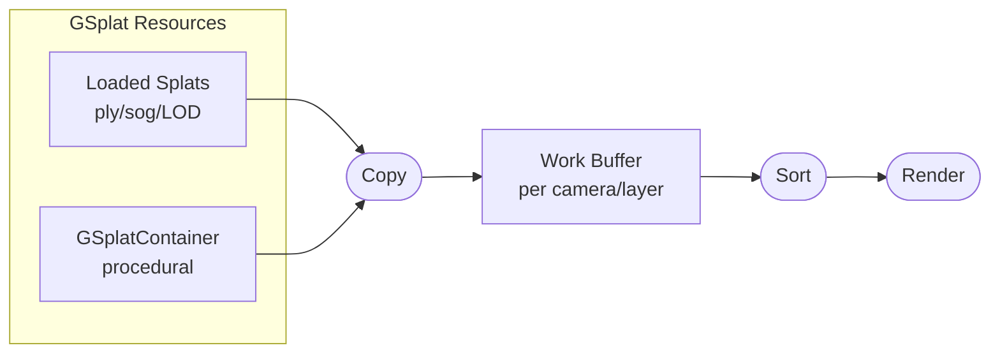

Unified Splat Rendering is the recommended rendering mode for Gaussian splats in PlayCanvas. It enables global sorting across multiple splat components and provides access to advanced features like procedural splats, LOD streaming, and GPU-based splat processing.

:::info Beta Feature

Unified Splat Rendering is currently in beta. If you encounter any issues, please report them on the [PlayCanvas Engine GitHub repository](https://github.com/playcanvas/engine/issues).

:::

## The Problem

Without unified rendering, multiple GSplat components are rendered independently. Each component's splats are sorted separately, and the components themselves are rendered based on their bounding boxes. This approach can lead to:

- **Visibility artifacts** when splat components overlap
- **Popping effects** as the camera moves and component render order changes
- **Incorrect depth sorting** between splats from different components

## The Solution: Unified Rendering

Unified rendering solves these issues by using a shared rendering pipeline with **work buffers**. All splats from all components are sorted together in a single unified sort, ensuring correct rendering order across the entire scene.

## Architecture Overview

The unified rendering pipeline consists of data storage and operations:

### GSplat Resources

GSplat resources are the source data for splats. They come in two forms:

1. **Loaded splats**: Imported from files (`.ply`, `.sog`) or streamed via [LOD streaming](/user-manual/gaussian-splatting/building/unified-rendering/lod-streaming)
2. **Procedural splats**: Created programmatically using [GSplatContainer](/user-manual/gaussian-splatting/building/unified-rendering/procedural-splats/)

Each resource stores splat data in GPU textures according to a [data format](/user-manual/gaussian-splatting/building/unified-rendering/splat-data-format).

### Work Buffers

Work buffers are automatically created for each camera/layer combination that renders GSplat components in unified mode. They serve as an intermediate storage where:

1. All splat data from visible components is **copied** into the work buffer
2. Splats are **globally sorted** by depth relative to the camera
3. The sorted data is ready for rendering

This architecture enables features that require access to all splats together, such as global sorting and cross-component effects.

### Camera Render

When a camera renders a layer containing unified GSplat components, it draws the sorted splats from the work buffer. This ensures correct depth ordering regardless of how many splat components exist or how they overlap.

## Live Example

Check out the [Global Sorting example](https://playcanvas.github.io/#/gaussian-splatting/global-sorting) which demonstrates the difference between unified and non-unified rendering. The example allows you to toggle unified mode on and off to observe how it eliminates artifacts when rendering multiple overlapping splat components.

## Benefits

- **Improved Visual Quality**: Eliminates artifacts when rendering multiple overlapping splat components
- **Consistent Rendering**: Maintains correct depth sorting regardless of camera position
- **Better Scene Composition**: Enables complex scenes with many splat components
- **Advanced Features**: Unlocks procedural splats, LOD streaming, and GPU processing

## Unified Rendering Features

The following features are available when using unified mode:

- [Splat Data Format](/user-manual/gaussian-splatting/building/unified-rendering/splat-data-format) - Custom texture formats for splat data
- [Procedural Splats](/user-manual/gaussian-splatting/building/unified-rendering/procedural-splats/) - Create splats programmatically
- [LOD Streaming](/user-manual/gaussian-splatting/building/unified-rendering/lod-streaming) - Dynamic level-of-detail loading
- [Splat Processing](/user-manual/gaussian-splatting/building/unified-rendering/splat-processing) - GPU-based splat manipulation

## See Also

- [GSplatComponent API](https://api.playcanvas.com/engine/classes/GSplatComponent.html)
- [Draw Order and Sorting](/user-manual/gaussian-splatting/building/draw-order)
- [Splat Rendering Architecture](/user-manual/gaussian-splatting/building/rendering-architecture)
- [Global Sorting Example](https://playcanvas.github.io/#/gaussian-splatting/global-sorting)
