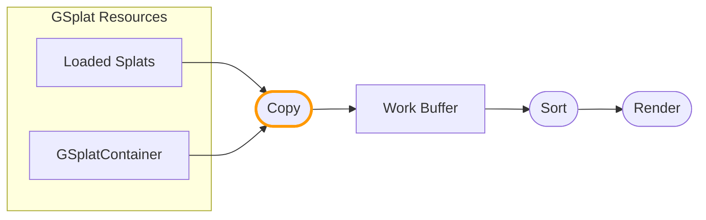

The work buffer format defines the data streams available in the work buffer and how splat data is copied from resources. You can customize the copy operation to transform splats and write additional per-component data.

:::info Beta Feature

Work Buffer Format customization is currently in beta. If you encounter any issues, please report them on the [PlayCanvas Engine GitHub repository](https://github.com/playcanvas/engine/issues).

:::

:::note

This feature requires [unified rendering](/user-manual/gaussian-splatting/building/unified-rendering/) mode.

:::

## Pipeline Overview

In unified rendering, splat data flows from resources through a **Copy** operation into the work buffer:



The Copy operation runs for each gsplat component and can be customized per-component using `setWorkBufferModifier()`.

## Customizing the Copy Operation

Use `setWorkBufferModifier()` on each gsplat component to customize how its splats are copied to the work buffer.

### Modifier Functions

Your modifier code must implement three functions:

| Function | Purpose |
|----------|---------|
| `modifySplatCenter(inout vec3 center)` | Modify splat position |
| `modifySplatRotationScale(vec3 originalCenter, vec3 modifiedCenter, inout vec4 rotation, inout vec3 scale)` | Modify rotation and scale |
| `modifySplatColor(vec3 center, inout vec4 color)` | Modify color and write to extra streams |

`modifySplatCenter` always executes first. You can use it to sample extra streams and store values in global variables, or execute code shared between the three functions.

### Basic Example

```javascript
entity.gsplat.setWorkBufferModifier({
    glsl: `
        void modifySplatCenter(inout vec3 center) {
            // Offset all splats upward
            center.y += 1.0;
        }
        void modifySplatRotationScale(vec3 originalCenter, vec3 modifiedCenter, 
                                       inout vec4 rotation, inout vec3 scale) {}
        void modifySplatColor(vec3 center, inout vec4 color) {
            // Tint splats red
            color.rgb *= vec3(1.0, 0.5, 0.5);
        }
    `,
    wgsl: `
        fn modifySplatCenter(center: ptr<function, vec3f>) {
            (*center).y += 1.0;
        }
        fn modifySplatRotationScale(originalCenter: vec3f, modifiedCenter: vec3f, 
                                     rotation: ptr<function, vec4f>, scale: ptr<function, vec3f>) {}
        fn modifySplatColor(center: vec3f, color: ptr<function, vec4f>) {
            *color = vec4f((*color).rgb * vec3f(1.0, 0.5, 0.5), (*color).a);
        }
    `
});
```

## Adding Extra Streams

By default, the work buffer contains standard splat data (position, color, rotation, scale). You can add additional streams to store custom per-splat data:

```javascript
// Add a stream to store component IDs (R32U = unsigned int)
app.scene.gsplat.format.addExtraStreams([
    { name: 'splatId', format: pc.PIXELFORMAT_R32U }
]);
```

Common stream formats:
- `PIXELFORMAT_R32U` - Single unsigned integer (e.g., component IDs)
- `PIXELFORMAT_RGBA8` - 4 bytes (e.g., packed data)
- `PIXELFORMAT_RGBA16F` - 4 half floats (e.g., custom attributes)
- `PIXELFORMAT_RGBA32F` - 4 floats (e.g., high precision data)

:::note

Streams cannot be removed once added. The `GSPLAT_STREAM_INSTANCE` storage option is ignored for work buffer formats.

:::

## Writing to Extra Streams

For each extra stream, a write function is generated: `write{StreamName}()`. For example, a stream named `splatId` generates `writeSplatId()`.

:::note

Each `setWorkBufferModifier` must write to **all** extra streams defined in the work buffer format. All components share the same work buffer format, so their modifiers must be consistent.

:::

```javascript
entity.gsplat.setWorkBufferModifier({
    glsl: `
        uniform uint uComponentId;

        void modifySplatCenter(inout vec3 center) {}
        void modifySplatRotationScale(vec3 originalCenter, vec3 modifiedCenter, 
                                       inout vec4 rotation, inout vec3 scale) {}
        void modifySplatColor(vec3 center, inout vec4 color) {
            // Write component ID to the splatId stream
            writeSplatId(uvec4(uComponentId, 0u, 0u, 0u));
        }
    `,
    wgsl: `
        uniform uComponentId: u32;

        fn modifySplatCenter(center: ptr<function, vec3f>) {}
        fn modifySplatRotationScale(originalCenter: vec3f, modifiedCenter: vec3f, 
                                     rotation: ptr<function, vec4f>, scale: ptr<function, vec3f>) {}
        fn modifySplatColor(center: vec3f, color: ptr<function, vec4f>) {
            writeSplatId(vec4u(uniform.uComponentId, 0u, 0u, 0u));
        }
    `
});
```

## Passing Uniforms

Use `setParameter()`, `getParameter()`, and `deleteParameter()` on the component to manage uniform values:

```javascript
// Set a uniform
entity.gsplat.setParameter('uComponentId', componentIndex);

// Get a uniform value
const id = entity.gsplat.getParameter('uComponentId');

// Delete a uniform
entity.gsplat.deleteParameter('uComponentId');
```

Supported uniform types:
- Numbers (int, float, uint)
- Arrays (vec2, vec3, vec4, mat4, etc.)
- `Texture` objects
- `StorageBuffer` objects

## Reading Source Data

In the copy modifier, you can read the original splat data using load functions generated from the [splat data format](/user-manual/gaussian-splatting/building/unified-rendering/splat-data-format). For example, with the default format:

- `loadDataColor()` - Returns `vec4` color
- `loadDataCenter()` - Returns `vec4` position (xyz) + extra data (w)
- `loadDataScale()` - Returns `vec4` scale
- `loadDataRotation()` - Returns `vec4` rotation quaternion

### Reading from Different Indices

Each load function has a `WithIndex` variant to read from a specific splat index:

```glsl
// GLSL - Read neighbor splat data
vec4 neighborCenter = loadDataCenterWithIndex(neighborIndex);
```

To read multiple attributes from the same different index, use `setSplat()` to change the current index:

```glsl
// GLSL - Read multiple attributes from another splat
setSplat(otherIndex);
vec3 otherPos = getCenter();
vec4 otherColor = getColor();
```

See [Splat Data Format - Shader Access](/user-manual/gaussian-splatting/building/unified-rendering/splat-data-format#shader-access) for more details.

## Live Example

See the [LOD Instances example](https://playcanvas.github.io/#/gaussian-splatting/lod-instances) which demonstrates:
- Adding a `splatId` stream to the work buffer
- Writing component IDs during copy using `setWorkBufferModifier()`
- Passing uniforms with `setParameter()`

## See Also

- [Work Buffer Rendering](/user-manual/gaussian-splatting/building/unified-rendering/work-buffer-rendering) - Customizing the render operation
- [Splat Data Format](/user-manual/gaussian-splatting/building/unified-rendering/splat-data-format)
- [Unified Splat Rendering](/user-manual/gaussian-splatting/building/unified-rendering/)
