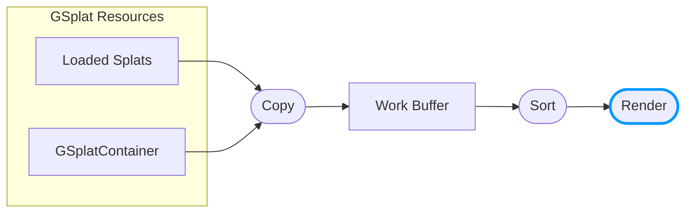

The render operation draws sorted splats from the work buffer. You can customize this globally to apply effects, read custom data written during copy, or modify how all splats appear.

:::info Beta Feature

Work Buffer Rendering customization is currently in beta. If you encounter any issues, please report them on the [PlayCanvas Engine GitHub repository](https://github.com/playcanvas/engine/issues).

:::

:::note

This feature requires [unified rendering](/user-manual/gaussian-splatting/building/unified-rendering/) mode.

:::

## Pipeline Overview

After splats are copied to the work buffer and sorted, the **Render** operation draws them:



Unlike the copy modifier (per-component), the render modifier is **global** and applies to all splats rendered from the work buffer.

## Customizing the Render Operation

Use `getShaderChunks()` on the scene's gsplat material to set the `gsplatModifyVS` shader chunk:

```javascript
const glslModifier = `
    void modifySplatCenter(inout vec3 center) {}
    void modifySplatRotationScale(vec3 originalCenter, vec3 modifiedCenter, 
                                   inout vec4 rotation, inout vec3 scale) {}
    void modifySplatColor(vec3 center, inout vec4 color) {
        // Apply global color grading
        color.rgb = pow(color.rgb, vec3(0.8));
    }
`;

const wgslModifier = `
    fn modifySplatCenter(center: ptr<function, vec3f>) {}
    fn modifySplatRotationScale(originalCenter: vec3f, modifiedCenter: vec3f, 
                                 rotation: ptr<function, vec4f>, scale: ptr<function, vec3f>) {}
    fn modifySplatColor(center: vec3f, color: ptr<function, vec4f>) {
        *color = vec4f(pow((*color).rgb, vec3f(0.8)), (*color).a);
    }
`;

app.scene.gsplat.material.getShaderChunks('glsl').set('gsplatModifyVS', glslModifier);
app.scene.gsplat.material.getShaderChunks('wgsl').set('gsplatModifyVS', wgslModifier);
app.scene.gsplat.material.update();
```

### Modifier Functions

Your modifier code must implement three functions:

| Function | Purpose |
|----------|---------|
| `modifySplatCenter(inout vec3 center)` | Modify splat position |
| `modifySplatRotationScale(vec3 originalCenter, vec3 modifiedCenter, inout vec4 rotation, inout vec3 scale)` | Modify rotation and scale |
| `modifySplatColor(vec3 center, inout vec4 color)` | Modify color based on work buffer data |

`modifySplatCenter` always executes first. You can use it to sample extra streams and store values in global variables, or execute code shared between the three functions.

### Removing the Modifier

To remove customization and restore default rendering:

```javascript
app.scene.gsplat.material.getShaderChunks('glsl').delete('gsplatModifyVS');
app.scene.gsplat.material.getShaderChunks('wgsl').delete('gsplatModifyVS');
app.scene.gsplat.material.update();
```

## Reading Extra Stream Data

If you added extra streams to the [work buffer format](/user-manual/gaussian-splatting/building/unified-rendering/work-buffer-format) and wrote data during the copy operation, you can read it during rendering using load functions.

For each extra stream, a load function is generated: `load{StreamName}()`. For example, a stream named `splatId` generates `loadSplatId()`:

```javascript
const glslModifier = `
    uniform sampler2D uColorLookup;

    void modifySplatCenter(inout vec3 center) {}
    void modifySplatRotationScale(vec3 originalCenter, vec3 modifiedCenter, 
                                   inout vec4 rotation, inout vec3 scale) {}
    void modifySplatColor(vec3 center, inout vec4 color) {
        // Read component ID written during copy
        uint id = loadSplatId().r;
        
        // Look up color from texture based on component ID
        vec3 tintColor = texelFetch(uColorLookup, ivec2(int(id), 0), 0).rgb;
        color.rgb *= tintColor;
    }
`;
```

### Generated Load Functions

For each extra stream, two load functions are generated:

| Function | Description |
|----------|-------------|
| `load{StreamName}()` | Reads from current splat |
| `load{StreamName}WithIndex(index)` | Reads from a specific splat index |

The return type depends on the stream's pixel format:

- **Float formats** (e.g., `PIXELFORMAT_RGBA32F`, `PIXELFORMAT_RGBA16F`) → `vec4`
- **Unsigned integer formats** (e.g., `PIXELFORMAT_R32U`) → `uvec4`
- **Signed integer formats** → `ivec4`

Examples:

| Stream Name | Load Functions |
|-------------|----------------|
| `splatId` | `loadSplatId()`, `loadSplatIdWithIndex(index)` → `uvec4` |
| `customData` | `loadCustomData()`, `loadCustomDataWithIndex(index)` → `vec4` |

To read multiple attributes from a different index, use `setSplat(index)` to change the current splat:

```glsl
setSplat(otherIndex);
uint otherId = loadSplatId().r;
vec4 otherData = loadCustomData();
```

## Passing Uniforms

Use `setParameter()` on the scene's gsplat material to pass uniform values:

```javascript
// Create a color lookup texture
const colorTexture = new pc.Texture(device, {
    width: 256,
    height: 1,
    format: pc.PIXELFORMAT_RGBA32F,
    // ... other options
});

// Pass texture to the render shader
app.scene.gsplat.material.setParameter('uColorLookup', colorTexture);
```

## Use Cases

### Per-Component Coloring

Combined with [work buffer format customization](/user-manual/gaussian-splatting/building/unified-rendering/work-buffer-format), you can identify which component each splat belongs to and apply unique colors:

1. During copy: Write component ID to an extra stream
2. During render: Read the ID and look up a color from a texture

```javascript
const glslModifier = `
    uniform sampler2D uColorLookup;
    uint componentId;  // Global variable accessible by all modifier functions

    void modifySplatCenter(inout vec3 center) {
        // Read ID from work buffer (can be used in other functions)
        componentId = loadSplatId().r;
    }
    void modifySplatRotationScale(vec3 originalCenter, vec3 modifiedCenter, 
                                   inout vec4 rotation, inout vec3 scale) {}
    void modifySplatColor(vec3 center, inout vec4 color) {
        // Look up color from texture based on component ID
        vec3 tintColor = texelFetch(uColorLookup, ivec2(int(componentId), 0), 0).rgb;
        color.rgb *= tintColor;
    }
`;
```

## Live Example

See the [LOD Instances example](https://playcanvas.github.io/#/gaussian-splatting/lod-instances) which demonstrates:

- Reading component IDs written during copy
- Looking up colors from a texture
- Applying per-component tinting with animated colors

## See Also

- [Work Buffer Format](/user-manual/gaussian-splatting/building/unified-rendering/work-buffer-format) - Customizing the copy operation
- [Splat Data Format](/user-manual/gaussian-splatting/building/unified-rendering/splat-data-format)
- [Unified Splat Rendering](/user-manual/gaussian-splatting/building/unified-rendering/)
