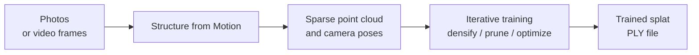

A Gaussian splat is reconstructed from a set of images that cover your subject from many viewpoints. Those images can be photographs, frames extracted from a video, or a combination of the two.

:::note

Source images can also be **synthetic** — rendered from a 3D package such as [Blender](https://www.blender.org/). This is useful for generating splats from scenes that don't exist in the real world.

:::

## Workflow

Creating a splat in PlayCanvas-friendly form is a three-step process:

1. **Capture your source imagery.** The quality of your final splat is bounded by the quality of these inputs. See [Taking Photos](taking-photos.md) for capture technique, equipment, coverage, and lighting.
2. **Choose a tool to process the imagery.** PlayCanvas does not itself convert images into a splat — the [Recommended Tools](recommended-tools.md) page compares the third-party options, from one-tap mobile apps to advanced desktop trainers.
3. **Run the tool.** It will perform Structure from Motion and training (described below) and output a `.ply` file that you can take into the rest of the PlayCanvas splat workflow.

## Inside the pipeline

Whichever tool you choose, what happens under the hood is broadly the same two stages.

### 1. Structure from Motion (SfM)

The input images are analyzed to recover the position and orientation of the camera for each shot, and to triangulate a sparse 3D point cloud of features detected across multiple views. This gives the trainer a starting geometry and a set of known viewpoints to optimize against.

### 2. Training

Starting from the SfM point cloud, the trainer runs many thousands of iterations of differentiable rendering, comparing what the current set of splats looks like from each known camera against the original photo. Each iteration adjusts the splats so the rendered views match the inputs more closely:

- **Densification** — splats are added in regions where the reconstruction is missing detail.
- **Pruning** — splats that contribute little (transparent, redundant, or in empty space) are removed.
- **Optimization** — every remaining splat's position, scale, rotation, color, and spherical harmonic coefficients are nudged to better match the input images.

Training typically takes anywhere from a few minutes to several hours, depending on the tool, the scene size, and the hardware available. Most advanced trainers require a CUDA-capable GPU — see the **Requirements** column in the [Recommended Tools](recommended-tools.md) table.

## Output

The result of training is a `.ply` file — the standard interchange format for 3D Gaussian splats. From here you can move on to the rest of the PlayCanvas splat workflow:

- Learn about the file format itself in [PLY](../formats/ply.md).
- Preview the result using the [PlayCanvas Model Viewer](../viewing.md).
- Clean it up and prepare it for delivery in [Editing Splats](../editing/index.md).
