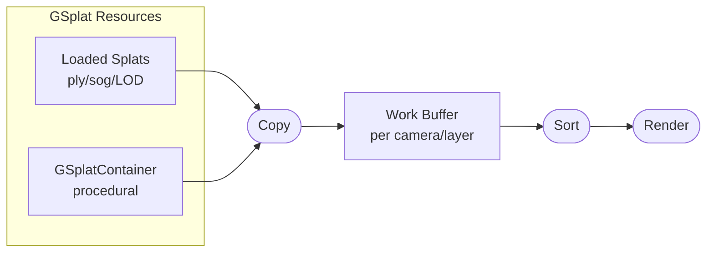

PlayCanvas renders Gaussian splats through a shared pipeline that sorts all splats from every GSplat component together. This global sorting ensures correct rendering order across the entire scene and provides access to advanced features like procedural splats, LOD streaming, and GPU-based splat processing.

## Global Sorting

All splats from all GSplat components are sorted together in a single global sort, rather than each component being sorted and ordered independently by its bounding box. Sorting everything together avoids:

- **Visibility artifacts** when splat components overlap
- **Popping effects** as the camera moves and component order changes
- **Incorrect depth sorting** between splats from different components

## Architecture Overview

The rendering pipeline consists of data storage and operations:

### GSplat Resources

GSplat resources are the source data for splats. They come in two forms:

1. **Loaded splats**: Imported from files (`.ply`, `.sog`) or streamed via [LOD streaming](/user-manual/gaussian-splatting/building/lod-streaming)
2. **Procedural splats**: Created programmatically using [GSplatContainer](/user-manual/gaussian-splatting/building/procedural-splats/)

Each resource stores splat data in GPU textures according to a [data format](/user-manual/gaussian-splatting/rendering-architecture/splat-data-format).

### Work Buffers

Work buffers are automatically created for each camera/layer combination that renders GSplat components. They serve as an intermediate storage where:

1. All splat data from visible components is **copied** into the work buffer
2. Splats are **globally sorted** by depth relative to the camera
3. The sorted data is ready for rendering

This architecture enables features that require access to all splats together, such as global sorting and cross-component effects.

### Camera Render

When a camera renders a layer containing GSplat components, it draws the sorted splats from the work buffer. This ensures correct depth ordering regardless of how many splat components exist or how they overlap.

## Live Example

The Global Sorting example demonstrates how sorting all splats together eliminates artifacts when rendering multiple overlapping splat components.

<EngineExample id="gaussian-splatting/global-sorting" title="Global Sorting example" />

## Benefits

- **Improved Visual Quality**: Eliminates artifacts when rendering multiple overlapping splat components
- **Consistent Rendering**: Maintains correct depth sorting regardless of camera position
- **Better Scene Composition**: Enables complex scenes with many splat components
- **Advanced Features**: Unlocks procedural splats, LOD streaming, and GPU processing

## Advanced Features

The following features build on this rendering pipeline:

- [Splat Data Format](/user-manual/gaussian-splatting/rendering-architecture/splat-data-format) - Custom texture formats for splat data
- [Procedural Splats](/user-manual/gaussian-splatting/building/procedural-splats/) - Create splats programmatically
- [LOD Streaming](/user-manual/gaussian-splatting/building/lod-streaming) - Dynamic level-of-detail loading
- [Splat Processing](/user-manual/gaussian-splatting/rendering-architecture/splat-processing) - GPU-based splat manipulation

## See Also

- [GSplatComponent API](https://api.playcanvas.com/engine/classes/GSplatComponent.html)
- [Renderers](/user-manual/gaussian-splatting/rendering-architecture/renderers)
