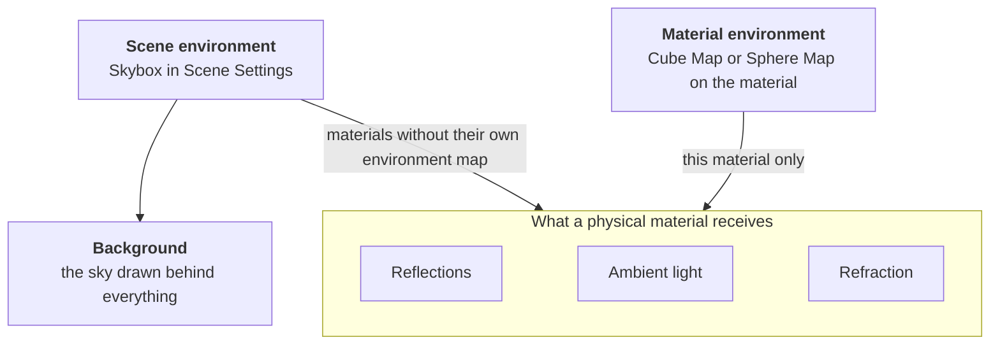

Physical materials do not only react to the lights in your scene. They also pick up light from their surroundings: a shiny surface mirrors what is around it, a matte surface is tinted by the light arriving from every direction, and a glass surface shows the surroundings through it. All of this comes from an **environment map**, an image of the surroundings such as a sky, a room or an outdoor location.

PlayCanvas can take that environment map from two places: the scene, or the material itself. This page explains what the environment contributes to a material, where it can come from, which source is used when, and which settings change the result.

## What the environment feeds



**Reflections.** The surface mirrors the environment. Smooth surfaces show a sharp image, rough surfaces a soft, blurred one, and metals tint the reflection with their own color. The material's Glossiness, Metalness and Reflectivity control how strong and how sharp the reflection is.

**Ambient light.** Light that reaches the surface from all directions without coming from a specific light entity. With an environment map, ambient light varies with direction: brighter and bluer from the sky above, darker and warmer from the ground below. This is what makes an object look like it belongs in its surroundings. Without an environment map, ambient light is the flat **Ambient Color** from Scene Settings.

**Refraction.** For materials with Refraction enabled but without Dynamic Refractions, the environment is what you see through the surface, bent according to the Index of Refraction. Dynamic Refractions show the actual objects behind the surface instead and do not use the environment.

**Background.** The sky drawn behind everything else. Only the scene environment is drawn as the background. A material environment map affects the material it is assigned to and nothing else.

## The scene environment

The scene environment is the **Skybox** in Scene Settings → Rendering, or `app.scene.skybox` and `app.scene.envAtlas` in code. It is drawn as the background and lights every material that does not bring an environment of its own.

To light materials, the skybox cubemap must be **prefiltered**: the Prefilter button on the [cubemap asset](/user-manual/editor/assets/inspectors/cubemap/) precomputes the blurred versions needed for rough reflections and ambient light. A cubemap that is not prefiltered is drawn as the background only. See [Image Based Lighting](/user-manual/graphics/physical-rendering/image-based-lighting/) for authoring and prefiltering environment maps.

The following settings in Scene Settings → Rendering apply to the scene environment only:

| Setting | Effect |
| --- | --- |
| **Intensity** | Brightens or darkens the sky together with everything it lights: reflections, ambient light and refraction. Use it to match the exposure of your lights. |
| **Rotation** | Turns the environment around the scene. Reflections and ambient light turn with it. |
| **Mip** | Blurs the background only. Materials keep their sharp reflections. |
| **Ambient Color** | The flat ambient light, used only by materials that take no ambient light from an environment map. |

## The material environment

A material can bring its own environment in the **Environment** section of the [material inspector](/user-manual/editor/assets/inspectors/material/#environment), or through the matching properties in code. A typical use is a cubemap of a room rendered from where the object stands, so that the reflections match the walls, floor and windows around it.

| Setting | Effect |
| --- | --- |
| **Cube Map** (`cubeMap`) | A cubemap of the object's surroundings. If the cubemap is prefiltered, the material takes reflections, ambient light and refraction from it, just as it would from the scene skybox. A cubemap that is not prefiltered gives mirror-sharp reflections regardless of glossiness, and the ambient light falls back to the flat Ambient Color. |
| **Sphere Map** (`sphereMap`) | A single 2D image of the surroundings as seen in a mirrored ball. The cheapest option: reflections only, fixed to the camera, so the reflection does not move when the camera orbits the object. Cube Map takes precedence when both are set. Sphere maps are kept for existing content and are planned for removal in a future major release. |
| **Use Skybox** (`useSkybox`) | Whether the material may use the scene environment when it has no environment map of its own. Switch it off for a material that should not reflect the sky at all. It has no effect on a material with its own environment map. |
| **Projection** (`cubeMapProjection`) | How the environment is placed around the object. **Normal** treats it as infinitely far away, which is right for a sky. **Box** maps it onto a box with the position and size you give, so that reflections line up with the walls, floor and ceiling of a room. See [Box Projection Mapping](/user-manual/graphics/physical-rendering/image-based-lighting/#box-projection-mapping). |
| **Reflectivity** (`reflectivity`) | Scales the strength of the environment reflection on this material, whichever environment it uses. |
| **Ambient** color (`ambient`) | Tints the ambient light on this material, whichever environment it uses. |

In code, the prefiltered lighting is a single texture called the environment atlas (`envAtlas`), which the `EnvLighting` helpers generate from a cubemap or an equirectangular image. Setting it on a material gives reflections, ambient light and refraction; setting a cube map alongside it adds mirror-sharp reflections on very glossy surfaces.

## Which environment is used

The rule is simple: **a material with an environment map of its own uses only that. Everything else comes from the scene.**

| Material environment | Use Skybox | Reflections and refraction | Ambient light |
| --- | --- | --- | --- |
| None | On (default) | Scene skybox | Scene skybox |
| None | Off | None | Ambient Color |
| Prefiltered cube map | Any | Material cube map | Material cube map |
| Plain cube map or sphere map | Any | Material map | Ambient Color |

A material environment replaces the scene environment completely. The scene's Intensity and Rotation do not apply to it, and the scene does not fill in the ambient light for a plain cube map or a sphere map. If you want directional ambient light on a material with its own environment, prefilter its cubemap in the Editor, or generate an environment atlas for it in code.

:::note

Before Engine v2.23, a material with a plain cube map took its ambient light from the scene skybox. From v2.23, the material environment is all-or-nothing as described above, so such a material now uses the Ambient Color. Prefilter the cubemap to get image-based ambient light back.

:::

## Setting it up in code

```javascript
// Scene environment from an HDR image: a sharp sky for the background and mirror-like
// reflections, plus a prefiltered lighting atlas for ambient light and rough reflections
const skybox = pc.EnvLighting.generateSkyboxCubemap(hdrTexture);
const lighting = pc.EnvLighting.generateLightingSource(hdrTexture);
const envAtlas = pc.EnvLighting.generateAtlas(lighting);
lighting.destroy();

app.scene.skybox = skybox;
app.scene.envAtlas = envAtlas;
app.scene.skyboxIntensity = 1.5;

// Material environment: this material ignores the scene skybox and reflects its own surroundings
const material = new pc.StandardMaterial();
material.envAtlas = roomAtlas;   // prefiltered lighting: reflections, ambient light and refraction
material.cubeMap = roomCubemap;  // optional: mirror-sharp reflections on very glossy surfaces
material.update();
```

## Examples

- [HDR](https://playcanvas.github.io/#/graphics/hdr): a scene lit by a prefiltered environment atlas.
- [Reflection Cubemap](https://playcanvas.github.io/#/graphics/reflection-cubemap): a material with its own cubemap, rendered at runtime from the object's position, with Use Skybox switched off.
- [Reflection Box](https://playcanvas.github.io/#/graphics/reflection-box): a room whose materials use an environment atlas with Box projection so that the reflections line up with the walls.
