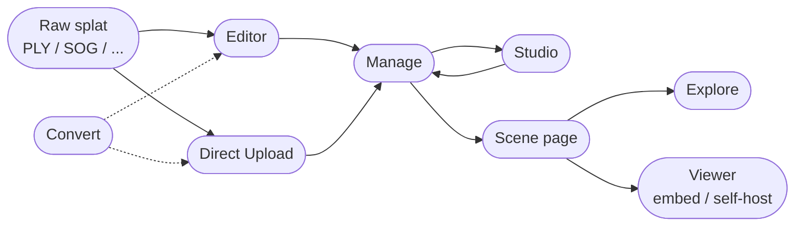

[SuperSplat](https://superspl.at) is PlayCanvas's editing and publishing platform for 3D Gaussian Splats. It takes a raw splat capture all the way from cleanup to a polished, shareable scene with cameras, animations, annotations, post effects, and collision — viewable in any modern browser.

The platform is made up of several pieces. Some you'll use as a creator, some your visitors use to view what you've made, and some are general-purpose utilities.

:::tip You can skip the Editor

If you already have a clean splat file, you don't need to use the Editor. Hit the orange **Upload Splat** button on the [superspl.at home page](https://superspl.at) (or on your [Manage page](manage)) to publish straight to the platform.

:::

## The platform

| Surface | What it is | Where it lives |
|---------|------------|----------------|
| **[Editor](editor/)** | Browser-based editor for cleaning, cropping, color-adjusting, and animating splats. Publishes to superspl.at. | [superspl.at/editor](https://superspl.at/editor) |
| **[Direct Upload](upload)** | Publish an already-clean splat file without opening the Editor. | The orange **Upload Splat** button on [superspl.at](https://superspl.at) |
| **[Manage](manage)** | Your splat library: edit title/description, change visibility, choose downloadable + license, delete, open in Studio. | [superspl.at/manage](https://superspl.at/manage) |
| **[Studio](studio/)** | Curate the published viewing experience: cameras, animations, annotations, post effects, skybox, collision. YouTube-Studio-style per-scene URL. | `superspl.at/scene/<hash>/studio` |
| **[Scene page](scene-page)** | Public page for a published splat: embedded viewer, share, embed, download, comments, likes, suggested splats. | `superspl.at/scene/<hash>` |
| **[Explore](explore)** | Public gallery with sort, time, feature filters, and search. The superspl.at home page. | [superspl.at](https://superspl.at) |
| **[User Profile](user-profile)** | A user's public page: avatar, bio, social links, their published splats. | `superspl.at/user?id=<username>` |
| **[Viewer](viewer/)** | The open-source web viewer that powers scene pages and Editor HTML exports. Embed in your own page or self-host. | npm `@playcanvas/supersplat-viewer`, [GitHub](https://github.com/playcanvas/supersplat-viewer) |
| **[Convert](convert)** | Web frontend to the [splat-transform](/user-manual/splat-transform/) CLI: convert formats, transform, and filter in the browser. | [superspl.at/convert](https://superspl.at/convert) |

## Open source vs hosted

SuperSplat is built on open foundations, with a hosted platform layered on top.

| Component | Source | License |
|-----------|--------|---------|
| Editor | [playcanvas/supersplat](https://github.com/playcanvas/supersplat) | MIT |
| Viewer | [playcanvas/supersplat-viewer](https://github.com/playcanvas/supersplat-viewer) | MIT |
| splat-transform (powers Convert) | [playcanvas/splat-transform](https://github.com/playcanvas/splat-transform) | MIT |
| Studio, Manage, Explore, Scene page, Convert UI, the publish/scene API | hosted by PlayCanvas on superspl.at | proprietary |

You can take the Editor's HTML export, or the Viewer npm package, and host published splats entirely on your own infrastructure if you prefer — see [Self-Hosting the Viewer](viewer/self-hosting).

## Accounts

A free PlayCanvas account is required to **publish splats** to superspl.at, **comment** on splats, and **like** splats. Browsing the [Explore](explore) page and viewing public [scene pages](scene-page) is anonymous. See [Account Creation](/user-manual/account-management/user-accounts/account-creation) to get started.

## What's next?

A typical first-time workflow:

1. [Open the Editor](editor/) and load your PLY, or skip to step 2 if you already have a clean file.
2. [Publish](editor/publishing) (from the Editor) or [Upload](upload) directly. The splat appears on your [Manage page](manage).
3. [Open it in Studio](studio/) and add cameras, animations, annotations, post effects, a skybox, or collision.
4. Share the [scene page](scene-page) URL, or [embed the Viewer](viewer/embedding) in your own site.
