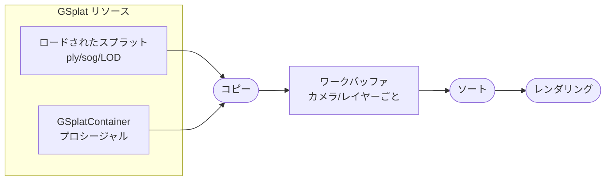

統合スプラットレンダリングは、PlayCanvasにおけるGaussian splatsの推奨レンダリングモードです。複数のスプラットコンポーネント間でグローバルソートを可能にし、プロシージャルスプラット、LODストリーミング、GPUベースのスプラット処理などの高度な機能へのアクセスを提供します。

:::info ベータ機能

統合スプラットレンダリングは現在ベータ版です。問題が発生した場合は、[PlayCanvas Engine GitHubリポジトリ](https://github.com/playcanvas/engine/issues)で報告してください。

:::

## 問題点

統合レンダリングがない場合、複数のGSplatコンポーネントは独立してレンダリングされます。各コンポーネントのスプラットは個別にソートされ、コンポーネント自体はバウンディングボックスに基づいてレンダリングされます。このアプローチは以下の問題を引き起こす可能性があります：

- スプラットコンポーネントが重なる際の**可視性のアーティファクト**
- カメラが移動しコンポーネントのレンダリング順序が変わる際の**ポッピングエフェクト**
- 異なるコンポーネントのスプラット間での**不正な深度ソート**

## 解決策：統合レンダリング

統合レンダリングは、**ワークバッファ**を使用した共有レンダリングパイプラインによってこれらの問題を解決します。すべてのコンポーネントのすべてのスプラットが単一の統合ソートで一緒にソートされ、シーン全体で正しいレンダリング順序が保証されます。

## アーキテクチャの概要

統合レンダリングパイプラインは、データストレージと操作で構成されます：

### GSplatリソース

GSplatリソースはスプラットのソースデータです。2つの形式があります：

1. **ロードされたスプラット**：ファイル（`.ply`、`.sog`）からインポートされるか、[LODストリーミング](/user-manual/gaussian-splatting/building/unified-rendering/lod-streaming)経由でストリーミングされます
2. **プロシージャルスプラット**：[GSplatContainer](/user-manual/gaussian-splatting/building/unified-rendering/procedural-splats/)を使用してプログラムで作成されます

各リソースは[データフォーマット](/user-manual/gaussian-splatting/building/unified-rendering/splat-data-format)に従ってGPUテクスチャにスプラットデータを格納します。

### ワークバッファ

ワークバッファは、統合モードでGSplatコンポーネントをレンダリングする各カメラ/レイヤーの組み合わせに対して自動的に作成されます。以下のための中間ストレージとして機能します：

1. 可視コンポーネントのすべてのスプラットデータがワークバッファに**コピー**される
2. スプラットはカメラに対する深度で**グローバルソート**される
3. ソートされたデータはレンダリングの準備が整う

このアーキテクチャにより、グローバルソートやクロスコンポーネントエフェクトなど、すべてのスプラットへのアクセスを必要とする機能が可能になります。

### カメラレンダリング

カメラが統合GSplatコンポーネントを含むレイヤーをレンダリングすると、ワークバッファからソートされたスプラットを描画します。これにより、スプラットコンポーネントがいくつ存在するか、またはどのように重なっているかに関係なく、正しい深度順序が保証されます。

## ライブサンプル

統合レンダリングと非統合レンダリングの違いを示す[Global Sortingサンプル](https://playcanvas.github.io/#/gaussian-splatting/global-sorting)をご覧ください。このサンプルでは、統合モードのオンとオフを切り替えて、複数の重なり合うスプラットコンポーネントをレンダリングする際にアーティファクトがどのように排除されるかを観察できます。

## メリット

- **視覚品質の向上**：複数の重なり合うスプラットコンポーネントをレンダリングする際のアーティファクトを排除
- **一貫したレンダリング**：カメラ位置に関係なく正しい深度ソートを維持
- **より良いシーン構成**：多くのスプラットコンポーネントを持つ複雑なシーンを可能に
- **高度な機能**：プロシージャルスプラット、LODストリーミング、GPU処理をアンロック

## 統合レンダリング機能

統合モード使用時に利用可能な機能：

- [スプラットデータフォーマット](/user-manual/gaussian-splatting/building/unified-rendering/splat-data-format) - スプラットデータのカスタムテクスチャフォーマット
- [プロシージャルスプラット](/user-manual/gaussian-splatting/building/unified-rendering/procedural-splats/) - プログラムによるスプラットの作成
- [LODストリーミング](/user-manual/gaussian-splatting/building/unified-rendering/lod-streaming) - 動的な詳細レベルのロード
- [スプラット処理](/user-manual/gaussian-splatting/building/unified-rendering/splat-processing) - GPUベースのスプラット操作

## 関連項目

- [GSplatComponent API](https://api.playcanvas.com/engine/classes/GSplatComponent.html)
- [描画順序とソート](/user-manual/gaussian-splatting/building/draw-order)
- [スプラットレンダリングアーキテクチャ](/user-manual/gaussian-splatting/building/rendering-architecture)
- [Global Sortingサンプル](https://playcanvas.github.io/#/gaussian-splatting/global-sorting)
