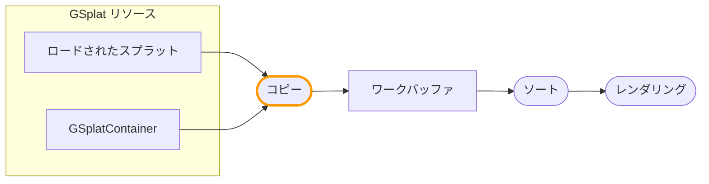

ワークバッファフォーマットは、ワークバッファで利用可能なデータストリームと、スプラットデータがリソースからどのようにコピーされるかを定義します。コピー操作をカスタマイズして、スプラットを変換し、コンポーネントごとの追加データを書き込むことができます。

:::info ベータ機能

ワークバッファフォーマットのカスタマイズは現在ベータ版です。問題が発生した場合は、[PlayCanvas Engine GitHubリポジトリ](https://github.com/playcanvas/engine/issues)で報告してください。

:::

:::note

この機能は[統合レンダリング](/user-manual/gaussian-splatting/building/unified-rendering/)モードが必要です。

:::

## パイプラインの概要

統合レンダリングでは、スプラットデータは**コピー**操作を通じてリソースからワークバッファに流れます：



コピー操作は各gsplatコンポーネントに対して実行され、`setWorkBufferModifier()`を使用してコンポーネントごとにカスタマイズできます。

## コピー操作のカスタマイズ

各gsplatコンポーネントで`setWorkBufferModifier()`を使用して、そのスプラットがワークバッファにどのようにコピーされるかをカスタマイズします。

### モディファイア関数

モディファイアコードは3つの関数を実装する必要があります：

| 関数 | 目的 |
|----------|---------|
| `modifySplatCenter(inout vec3 center)` | スプラットの位置を変更 |
| `modifySplatRotationScale(vec3 originalCenter, vec3 modifiedCenter, inout vec4 rotation, inout vec3 scale)` | 回転とスケールを変更 |
| `modifySplatColor(vec3 center, inout vec4 color)` | 色を変更し、追加ストリームに書き込む |

`modifySplatCenter`は常に最初に実行されます。追加ストリームをサンプリングして値をグローバル変数に格納したり、3つの関数間で共有されるコードを実行したりするために使用できます。

### 基本的な例

```javascript
entity.gsplat.setWorkBufferModifier({
    glsl: `
        void modifySplatCenter(inout vec3 center) {
            // すべてのスプラットを上にオフセット
            center.y += 1.0;
        }
        void modifySplatRotationScale(vec3 originalCenter, vec3 modifiedCenter, 
                                       inout vec4 rotation, inout vec3 scale) {}
        void modifySplatColor(vec3 center, inout vec4 color) {
            // スプラットを赤くティント
            color.rgb *= vec3(1.0, 0.5, 0.5);
        }
    `,
    wgsl: `
        fn modifySplatCenter(center: ptr<function, vec3f>) {
            (*center).y += 1.0;
        }
        fn modifySplatRotationScale(originalCenter: vec3f, modifiedCenter: vec3f, 
                                     rotation: ptr<function, vec4f>, scale: ptr<function, vec3f>) {}
        fn modifySplatColor(center: vec3f, color: ptr<function, vec4f>) {
            *color = vec4f((*color).rgb * vec3f(1.0, 0.5, 0.5), (*color).a);
        }
    `
});
```

## 追加ストリームの追加

デフォルトでは、ワークバッファには標準的なスプラットデータ（位置、色、回転、スケール）が含まれています。カスタムのスプラットごとのデータを格納するために追加ストリームを追加できます：

```javascript
// コンポーネントIDを格納するストリームを追加（R32U = unsigned int）
app.scene.gsplat.format.addExtraStreams([
    { name: 'splatId', format: pc.PIXELFORMAT_R32U }
]);
```

一般的なストリームフォーマット：

- `PIXELFORMAT_R32U` - 単一の符号なし整数（例：コンポーネントID）
- `PIXELFORMAT_RGBA8` - 4バイト（例：パックされたデータ）
- `PIXELFORMAT_RGBA16F` - 4つのhalf float（例：カスタム属性）
- `PIXELFORMAT_RGBA32F` - 4つのfloat（例：高精度データ）

:::note

ストリームは一度追加すると削除できません。`GSPLAT_STREAM_INSTANCE`ストレージオプションはワークバッファフォーマットでは無視されます。

:::

## 追加ストリームへの書き込み

追加ストリームごとに、書き込み関数が生成されます：`write{StreamName}()`。例えば、`splatId`という名前のストリームは`writeSplatId()`を生成します。

:::note

各`setWorkBufferModifier`は、ワークバッファフォーマットで定義された**すべての**追加ストリームに書き込む必要があります。すべてのコンポーネントは同じワークバッファフォーマットを共有するため、モディファイアは一貫している必要があります。

:::

```javascript
entity.gsplat.setWorkBufferModifier({
    glsl: `
        uniform uint uComponentId;

        void modifySplatCenter(inout vec3 center) {}
        void modifySplatRotationScale(vec3 originalCenter, vec3 modifiedCenter, 
                                       inout vec4 rotation, inout vec3 scale) {}
        void modifySplatColor(vec3 center, inout vec4 color) {
            // splatIdストリームにコンポーネントIDを書き込む
            writeSplatId(uvec4(uComponentId, 0u, 0u, 0u));
        }
    `,
    wgsl: `
        uniform uComponentId: u32;

        fn modifySplatCenter(center: ptr<function, vec3f>) {}
        fn modifySplatRotationScale(originalCenter: vec3f, modifiedCenter: vec3f, 
                                     rotation: ptr<function, vec4f>, scale: ptr<function, vec3f>) {}
        fn modifySplatColor(center: vec3f, color: ptr<function, vec4f>) {
            writeSplatId(vec4u(uniform.uComponentId, 0u, 0u, 0u));
        }
    `
});
```

## ユニフォームの受け渡し

コンポーネントで`setParameter()`、`getParameter()`、`deleteParameter()`を使用してユニフォーム値を管理します：

```javascript
// ユニフォームを設定
entity.gsplat.setParameter('uComponentId', componentIndex);

// ユニフォーム値を取得
const id = entity.gsplat.getParameter('uComponentId');

// ユニフォームを削除
entity.gsplat.deleteParameter('uComponentId');
```

サポートされているユニフォームタイプ：

- 数値（int、float、uint）
- 配列（vec2、vec3、vec4、mat4など）
- `Texture`オブジェクト
- `StorageBuffer`オブジェクト

## ソースデータの読み取り

コピーモディファイアでは、[スプラットデータフォーマット](/user-manual/gaussian-splatting/building/unified-rendering/splat-data-format)から生成されたロード関数を使用して元のスプラットデータを読み取ることができます。デフォルトフォーマットの場合：

- `loadDataColor()` - `vec4`の色を返す
- `loadDataCenter()` - `vec4`の位置(xyz) + 追加データ(w)を返す
- `loadDataScale()` - `vec4`のスケールを返す
- `loadDataRotation()` - `vec4`の回転クォータニオンを返す

### 異なるインデックスからの読み取り

各ロード関数には、特定のスプラットインデックスから読み取るための`WithIndex`バリアントがあります：

```glsl
// GLSL - 隣接するスプラットデータを読み取る
vec4 neighborCenter = loadDataCenterWithIndex(neighborIndex);
```

同じ異なるインデックスから複数の属性を読み取るには、`setSplat()`を使用して現在のインデックスを変更します：

```glsl
// GLSL - 別のスプラットから複数の属性を読み取る
setSplat(otherIndex);
vec3 otherPos = getCenter();
vec4 otherColor = getColor();
```

詳細については[スプラットデータフォーマット - シェーダーアクセス](/user-manual/gaussian-splatting/building/unified-rendering/splat-data-format#shader-access)を参照してください。

## ライブサンプル

以下を示す[LOD Instancesサンプル](https://playcanvas.github.io/#/gaussian-splatting/lod-instances)を参照してください：

- ワークバッファへの`splatId`ストリームの追加
- `setWorkBufferModifier()`を使用したコピー中のコンポーネントIDの書き込み
- `setParameter()`によるユニフォームの受け渡し

## 関連項目

- [ワークバッファレンダリング](/user-manual/gaussian-splatting/building/unified-rendering/work-buffer-rendering) - レンダリング操作のカスタマイズ
- [スプラットデータフォーマット](/user-manual/gaussian-splatting/building/unified-rendering/splat-data-format)
- [統合スプラットレンダリング](/user-manual/gaussian-splatting/building/unified-rendering/)
