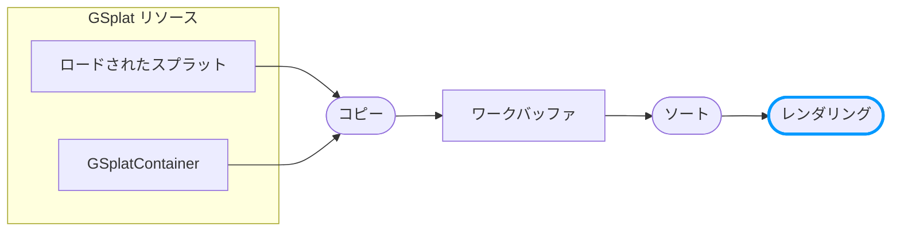

レンダリング操作は、ワークバッファからソートされたスプラットを描画します。エフェクトを適用したり、コピー中に書き込まれたカスタムデータを読み取ったり、すべてのスプラットの表示方法を変更したりするために、これをグローバルにカスタマイズできます。

:::info ベータ機能

ワークバッファレンダリングのカスタマイズは現在ベータ版です。問題が発生した場合は、[PlayCanvas Engine GitHubリポジトリ](https://github.com/playcanvas/engine/issues)で報告してください。

:::

:::note

この機能は[統合レンダリング](/user-manual/gaussian-splatting/building/unified-rendering/)モードが必要です。

:::

## パイプラインの概要

スプラットがワークバッファにコピーされソートされた後、**レンダリング**操作がそれらを描画します：



コピーモディファイア（コンポーネントごと）とは異なり、レンダリングモディファイアは**グローバル**であり、ワークバッファからレンダリングされるすべてのスプラットに適用されます。

## レンダリング操作のカスタマイズ

シーンのgsplatマテリアルで`getShaderChunks()`を使用して、`gsplatModifyVS`シェーダーチャンクを設定します：

```javascript
const glslModifier = `
    void modifySplatCenter(inout vec3 center) {}
    void modifySplatRotationScale(vec3 originalCenter, vec3 modifiedCenter, 
                                   inout vec4 rotation, inout vec3 scale) {}
    void modifySplatColor(vec3 center, inout vec4 color) {
        // グローバルカラーグレーディングを適用
        color.rgb = pow(color.rgb, vec3(0.8));
    }
`;

const wgslModifier = `
    fn modifySplatCenter(center: ptr<function, vec3f>) {}
    fn modifySplatRotationScale(originalCenter: vec3f, modifiedCenter: vec3f, 
                                 rotation: ptr<function, vec4f>, scale: ptr<function, vec3f>) {}
    fn modifySplatColor(center: vec3f, color: ptr<function, vec4f>) {
        *color = vec4f(pow((*color).rgb, vec3f(0.8)), (*color).a);
    }
`;

app.scene.gsplat.material.getShaderChunks('glsl').set('gsplatModifyVS', glslModifier);
app.scene.gsplat.material.getShaderChunks('wgsl').set('gsplatModifyVS', wgslModifier);
app.scene.gsplat.material.update();
```

### モディファイア関数

モディファイアコードは3つの関数を実装する必要があります：

| 関数 | 目的 |
|----------|---------|
| `modifySplatCenter(inout vec3 center)` | スプラットの位置を変更 |
| `modifySplatRotationScale(vec3 originalCenter, vec3 modifiedCenter, inout vec4 rotation, inout vec3 scale)` | 回転とスケールを変更 |
| `modifySplatColor(vec3 center, inout vec4 color)` | ワークバッファデータに基づいて色を変更 |

`modifySplatCenter`は常に最初に実行されます。追加ストリームをサンプリングして値をグローバル変数に格納したり、3つの関数間で共有されるコードを実行したりするために使用できます。

### モディファイアの削除

カスタマイズを削除してデフォルトのレンダリングに戻すには：

```javascript
app.scene.gsplat.material.getShaderChunks('glsl').delete('gsplatModifyVS');
app.scene.gsplat.material.getShaderChunks('wgsl').delete('gsplatModifyVS');
app.scene.gsplat.material.update();
```

## 追加ストリームデータの読み取り

[ワークバッファフォーマット](/user-manual/gaussian-splatting/building/unified-rendering/work-buffer-format)に追加ストリームを追加し、コピー操作中にデータを書き込んだ場合、ロード関数を使用してレンダリング中にそれを読み取ることができます。

追加ストリームごとに、ロード関数が生成されます：`load{StreamName}()`。例えば、`splatId`という名前のストリームは`loadSplatId()`を生成します：

```javascript
const glslModifier = `
    uniform sampler2D uColorLookup;

    void modifySplatCenter(inout vec3 center) {}
    void modifySplatRotationScale(vec3 originalCenter, vec3 modifiedCenter, 
                                   inout vec4 rotation, inout vec3 scale) {}
    void modifySplatColor(vec3 center, inout vec4 color) {
        // コピー中に書き込まれたコンポーネントIDを読み取る
        uint id = loadSplatId().r;
        
        // コンポーネントIDに基づいてテクスチャから色をルックアップ
        vec3 tintColor = texelFetch(uColorLookup, ivec2(int(id), 0), 0).rgb;
        color.rgb *= tintColor;
    }
`;
```

### 生成されたロード関数

追加ストリームごとに、2つのロード関数が生成されます：

| 関数 | 説明 |
|----------|-------------|
| `load{StreamName}()` | 現在のスプラットから読み取る |
| `load{StreamName}WithIndex(index)` | 特定のスプラットインデックスから読み取る |

戻り値の型はストリームのピクセルフォーマットに依存します：

- **浮動小数点フォーマット**（例：`PIXELFORMAT_RGBA32F`、`PIXELFORMAT_RGBA16F`）→ `vec4`
- **符号なし整数フォーマット**（例：`PIXELFORMAT_R32U`）→ `uvec4`
- **符号付き整数フォーマット** → `ivec4`

例：

| ストリーム名 | ロード関数 |
|-------------|----------------|
| `splatId` | `loadSplatId()`、`loadSplatIdWithIndex(index)` → `uvec4` |
| `customData` | `loadCustomData()`、`loadCustomDataWithIndex(index)` → `vec4` |

異なるインデックスから複数の属性を読み取るには、`setSplat(index)`を使用して現在のスプラットを変更します：

```glsl
setSplat(otherIndex);
uint otherId = loadSplatId().r;
vec4 otherData = loadCustomData();
```

## ユニフォームの受け渡し

シーンのgsplatマテリアルで`setParameter()`を使用してユニフォーム値を渡します：

```javascript
// カラールックアップテクスチャを作成
const colorTexture = new pc.Texture(device, {
    width: 256,
    height: 1,
    format: pc.PIXELFORMAT_RGBA32F,
    // ... その他のオプション
});

// レンダリングシェーダーにテクスチャを渡す
app.scene.gsplat.material.setParameter('uColorLookup', colorTexture);
```

## ユースケース

### コンポーネントごとの色付け

[ワークバッファフォーマットのカスタマイズ](/user-manual/gaussian-splatting/building/unified-rendering/work-buffer-format)と組み合わせることで、各スプラットがどのコンポーネントに属するかを識別し、ユニークな色を適用できます：

1. コピー中：追加ストリームにコンポーネントIDを書き込む
2. レンダリング中：IDを読み取り、テクスチャから色をルックアップ

```javascript
const glslModifier = `
    uniform sampler2D uColorLookup;
    uint componentId;  // すべてのモディファイア関数からアクセス可能なグローバル変数

    void modifySplatCenter(inout vec3 center) {
        // ワークバッファからIDを読み取る（他の関数で使用可能）
        componentId = loadSplatId().r;
    }
    void modifySplatRotationScale(vec3 originalCenter, vec3 modifiedCenter, 
                                   inout vec4 rotation, inout vec3 scale) {}
    void modifySplatColor(vec3 center, inout vec4 color) {
        // コンポーネントIDに基づいてテクスチャから色をルックアップ
        vec3 tintColor = texelFetch(uColorLookup, ivec2(int(componentId), 0), 0).rgb;
        color.rgb *= tintColor;
    }
`;
```

## ライブサンプル

以下を示す[LOD Instancesサンプル](https://playcanvas.github.io/#/gaussian-splatting/lod-instances)を参照してください：

- コピー中に書き込まれたコンポーネントIDの読み取り
- テクスチャからの色のルックアップ
- アニメーション色によるコンポーネントごとのティンティングの適用

## 関連項目

- [ワークバッファフォーマット](/user-manual/gaussian-splatting/building/unified-rendering/work-buffer-format) - コピー操作のカスタマイズ
- [スプラットデータフォーマット](/user-manual/gaussian-splatting/building/unified-rendering/splat-data-format)
- [統合スプラットレンダリング](/user-manual/gaussian-splatting/building/unified-rendering/)
