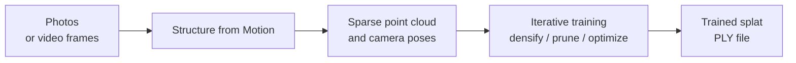

Gaussian splatは、被写体を多くの視点からカバーする画像のセットから再構築されます。これらの画像は、写真、ビデオから抽出されたフレーム、またはその両方の組み合わせである場合があります。

:::note

ソース画像は、[Blender](https://www.blender.org/)などの3Dパッケージからレンダリングされた**合成**画像にすることもできます。これは、現実世界には存在しないシーンからスプラットを生成する場合に便利です。

:::

## ワークフロー

PlayCanvasで扱える形式のスプラットを作成するプロセスは、3つのステップに分かれています。

1. **ソース画像をキャプチャする。** 最終的なスプラットの品質は、これらの入力の品質によって制限されます。撮影テクニック、機材、カバレッジ、ライティングについては、[写真の撮影](taking-photos.md)を参照してください。
2. **画像を処理するツールを選択する。** PlayCanvas自体は、画像をスプラットに変換するツールを提供していません。[推奨ツール](recommended-tools.md)のページでは、ワンタップのモバイルアプリから高度なデスクトップトレーナーまで、サードパーティの選択肢を比較しています。
3. **ツールを実行する。** ツールがStructure from Motionとトレーニング（後述）を実行し、`.ply`ファイルを出力します。このファイルは、PlayCanvasのスプラットワークフローの残りの部分で使用できます。

## パイプラインの内部

どのツールを選択しても、内部で行われていることは大まかに同じ2つの段階です。

### 1. Structure from Motion (SfM)

入力画像が分析され、各ショットのカメラの位置と向きが復元されます。また、複数のビューにわたって検出された特徴量から、スパースな3D点群が三角測量によって生成されます。これにより、トレーナーには初期ジオメトリと、最適化の対象となる既知の視点のセットが与えられます。

### 2. トレーニング

トレーナーはSfMの点群を出発点とし、微分可能レンダリングを数千回のイテレーションにわたって実行します。各イテレーションでは、現在のスプラット集合を既知の各カメラからレンダリングした結果と元の写真とを比較し、レンダリング結果が入力画像により近づくようにスプラットを調整します。

- **密度化（Densification）** — 再構築の詳細が不足している領域にスプラットが追加されます。
- **プルーニング（Pruning）** — ほとんど寄与していないスプラット（透明なもの、冗長なもの、空の空間にあるもの）が削除されます。
- **最適化（Optimization）** — 残った各スプラットの位置、スケール、回転、色、球面調和係数が、入力画像により良く一致するように調整されます。

トレーニングには通常、ツール、シーンのサイズ、利用可能なハードウェアに応じて、数分から数時間かかります。ほとんどの上級トレーナーはCUDA対応GPUを必要とします。詳細は[推奨ツール](recommended-tools.md)の表の**要件**列を参照してください。

## 出力

トレーニングの結果は`.ply`ファイル、つまり3D Gaussian splatsの標準交換フォーマットです。ここから、PlayCanvasのスプラットワークフローの残りの部分に進めます。

- ファイル形式自体については[PLY](../formats/ply.md)で詳しく学べます。
- [PlayCanvas Model Viewer](../viewing.md)を使用して結果をプレビューできます。
- [スプラットの編集](../editing/index.md)でクリーンアップを行い、配信用に準備できます。
