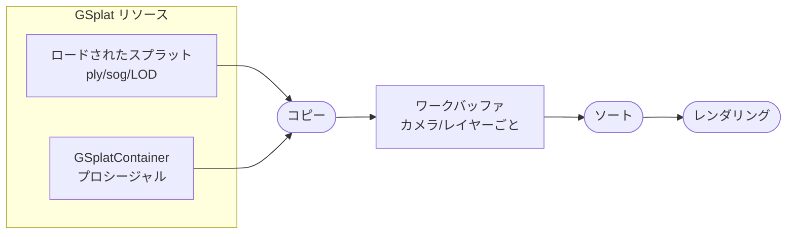

PlayCanvasは、すべてのGSplatコンポーネントのすべてのスプラットを一緒にソートする共有パイプラインを通じてGaussian splatsをレンダリングします。このグローバルソートにより、シーン全体で正しいレンダリング順序が保証され、プロシージャルスプラット、LODストリーミング、GPUベースのスプラット処理などの高度な機能へのアクセスが提供されます。

## グローバルソート

すべてのGSplatコンポーネントのすべてのスプラットは、各コンポーネントが個別にソートされバウンディングボックス順にレンダリングされるのではなく、単一のグローバルソートで一緒にソートされます。すべてを一緒にソートすることで、以下を回避します：

- スプラットコンポーネントが重なる際の**可視性のアーティファクト**
- カメラが移動しコンポーネントの順序が変わる際の**ポッピングエフェクト**
- 異なるコンポーネントのスプラット間での**不正な深度ソート**

## アーキテクチャの概要

レンダリングパイプラインは、データストレージと操作で構成されます：

### GSplatリソース

GSplatリソースはスプラットのソースデータです。2つの形式があります：

1. **ロードされたスプラット**：ファイル（`.ply`、`.sog`）からインポートされるか、[LODストリーミング](/user-manual/gaussian-splatting/building/lod-streaming)経由でストリーミングされます
2. **プロシージャルスプラット**：[GSplatContainer](/user-manual/gaussian-splatting/building/procedural-splats/)を使用してプログラムで作成されます

各リソースは[データフォーマット](/user-manual/gaussian-splatting/rendering-architecture/splat-data-format)に従ってGPUテクスチャにスプラットデータを格納します。

### ワークバッファ

ワークバッファは、GSplatコンポーネントをレンダリングする各カメラ/レイヤーの組み合わせに対して自動的に作成されます。以下のための中間ストレージとして機能します：

1. 可視コンポーネントのすべてのスプラットデータがワークバッファに**コピー**される
2. スプラットはカメラに対する深度で**グローバルソート**される
3. ソートされたデータはレンダリングの準備が整う

このアーキテクチャにより、グローバルソートやクロスコンポーネントエフェクトなど、すべてのスプラットへのアクセスを必要とする機能が可能になります。

### カメラレンダリング

カメラがGSplatコンポーネントを含むレイヤーをレンダリングすると、ワークバッファからソートされたスプラットを描画します。これにより、スプラットコンポーネントがいくつ存在するか、またはどのように重なっているかに関係なく、正しい深度順序が保証されます。

## ライブサンプル

Global Sortingサンプルでは、すべてのスプラットを一緒にソートすることで、複数の重なり合うスプラットコンポーネントをレンダリングする際にアーティファクトがどのように排除されるかを確認できます。

<EngineExample id="gaussian-splatting/global-sorting" title="Global Sortingサンプル" />

## メリット

- **視覚品質の向上**：複数の重なり合うスプラットコンポーネントをレンダリングする際のアーティファクトを排除
- **一貫したレンダリング**：カメラ位置に関係なく正しい深度ソートを維持
- **より良いシーン構成**：多くのスプラットコンポーネントを持つ複雑なシーンを可能に
- **高度な機能**：プロシージャルスプラット、LODストリーミング、GPU処理をアンロック

## 高度な機能

以下の機能はこのレンダリングパイプラインに基づいています：

- [スプラットデータフォーマット](/user-manual/gaussian-splatting/rendering-architecture/splat-data-format) - スプラットデータのカスタムテクスチャフォーマット
- [プロシージャルスプラット](/user-manual/gaussian-splatting/building/procedural-splats/) - プログラムによるスプラットの作成
- [LODストリーミング](/user-manual/gaussian-splatting/building/lod-streaming) - 動的な詳細レベルのロード
- [スプラット処理](/user-manual/gaussian-splatting/rendering-architecture/splat-processing) - GPUベースのスプラット操作

## 関連項目

- [GSplatComponent API](https://api.playcanvas.com/engine/classes/GSplatComponent.html)
- [描画順序とソート](/user-manual/gaussian-splatting/building/draw-order)
