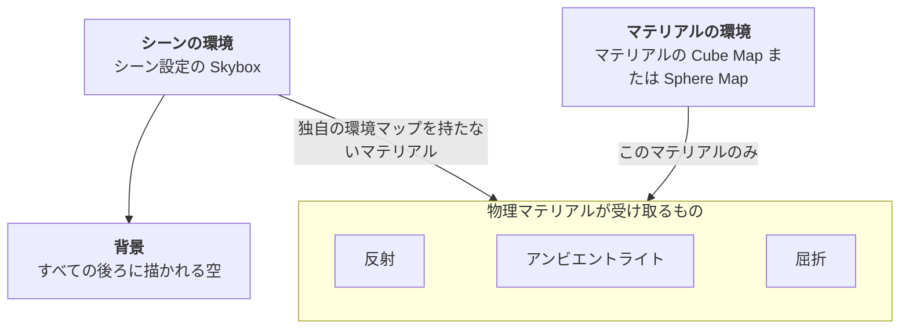

物理マテリアルは、シーン内のライトにだけ反応するわけではありません。周囲からの光も取り込みます。光沢のある表面は周囲を鏡のように映し、マットな表面はあらゆる方向から届く光で色づき、ガラスの表面は周囲を透かして見せます。これらはすべて、空・部屋・屋外の風景など周囲の画像である **環境マップ** から得られます。

PlayCanvas は、この環境マップをシーンとマテリアル自身の 2 つの場所から取得できます。このページでは、環境がマテリアルに何を供給するか、どこから供給されるか、どちらがいつ使われるか、そしてどの設定が結果を変えるかを説明します。

## 環境が供給するもの



**反射。** 表面が環境を鏡のように映します。滑らかな表面は鮮明な像を、粗い表面は柔らかくぼけた像を映し、金属は反射を自身の色で染めます。マテリアルの Glossiness、Metalness、Reflectivity が反射の強さと鮮明さを制御します。

**アンビエントライト。** 特定のライトエンティティからではなく、あらゆる方向から表面に届く光です。環境マップがある場合、アンビエントライトは方向によって変化します。上の空からは明るく青みがかった光、下の地面からは暗く暖かい光が届きます。これにより、オブジェクトが周囲に自然に溶け込んで見えます。環境マップがない場合、アンビエントライトはシーン設定の一様な **Ambient Color** になります。

**屈折。** Refraction が有効で Dynamic Refractions が無効なマテリアルでは、表面を透かして見えるものが環境であり、Index of Refraction に従って曲げられます。Dynamic Refractions は代わりに表面の後ろにある実際のオブジェクトを表示し、環境を使用しません。

**背景。** 他のすべての後ろに描かれる空です。背景として描かれるのはシーンの環境だけです。マテリアルの環境マップは、割り当てられたマテリアルにのみ影響し、それ以外には影響しません。

## シーンの環境

シーンの環境は、シーン設定 → Rendering の **Skybox**、コードでは `app.scene.skybox` と `app.scene.envAtlas` です。背景として描かれ、独自の環境を持たないすべてのマテリアルをライティングします。

マテリアルをライティングするには、スカイボックスのキューブマップを **プリフィルタ** する必要があります。[キューブマップアセット](/user-manual/editor/assets/inspectors/cubemap/)の Prefilter ボタンが、粗い反射とアンビエントライトに必要なぼかしたバージョンを事前計算します。プリフィルタされていないキューブマップは背景としてのみ描かれます。環境マップの作成とプリフィルタについては、[イメージベースドライティング](/user-manual/graphics/physical-rendering/image-based-lighting/)を参照してください。

シーン設定 → Rendering の次の設定は、シーンの環境にのみ適用されます。

| 設定 | 効果 |
| --- | --- |
| **Intensity** | 空と、空がライティングするすべて(反射、アンビエントライト、屈折)を一緒に明るくまたは暗くします。ライトの露出に合わせるために使用します。 |
| **Rotation** | シーンの周りで環境を回転させます。反射とアンビエントライトも一緒に回転します。 |
| **Mip** | 背景のみをぼかします。マテリアルの反射は鮮明なままです。 |
| **Ambient Color** | 一様なアンビエントライトです。環境マップからアンビエントライトを受け取らないマテリアルのみが使用します。 |

## マテリアルの環境

マテリアルは、[マテリアルインスペクタ](/user-manual/editor/assets/inspectors/material/#環境)の **Environment** セクション、またはコードの対応するプロパティで独自の環境を持つことができます。典型的な用途は、オブジェクトの位置からレンダリングした部屋のキューブマップで、反射を周囲の壁・床・窓に一致させることです。

| 設定 | 効果 |
| --- | --- |
| **Cube Map** (`cubeMap`) | オブジェクトの周囲のキューブマップです。プリフィルタされている場合、マテリアルはシーンのスカイボックスからと同様に、反射・アンビエントライト・屈折をそこから受け取ります。プリフィルタされていないキューブマップは、Glossiness に関係なく鏡のように鮮明な反射を与え、アンビエントライトは一様な Ambient Color にフォールバックします。 |
| **Sphere Map** (`sphereMap`) | 鏡面の球に映った周囲を 1 枚の 2D 画像にしたものです。最も軽量な選択肢で、反射のみを与え、カメラに固定されるため、カメラがオブジェクトの周りを回っても反射は動きません。両方が設定されている場合は Cube Map が優先されます。スフィアマップは既存コンテンツのために維持されており、将来のメジャーリリースで削除される予定です。 |
| **Use Skybox** (`useSkybox`) | 独自の環境マップを持たないマテリアルがシーンの環境を使用できるかどうかです。空をまったく反射させたくないマテリアルではオフにします。独自の環境マップを持つマテリアルには影響しません。 |
| **Projection** (`cubeMapProjection`) | 環境をオブジェクトの周りにどう配置するかです。**Normal** は環境を無限遠にあるものとして扱い、空に適しています。**Box** は指定した位置とサイズのボックスにマッピングし、反射を部屋の壁・床・天井に一致させます。[ボックスプロジェクションマッピング](/user-manual/graphics/physical-rendering/image-based-lighting/#ボックスのプロジェクションマッピング)を参照してください。 |
| **Reflectivity** (`reflectivity`) | どの環境を使用するかに関係なく、このマテリアルの環境反射の強さをスケーリングします。 |
| **Ambient** カラー (`ambient`) | どの環境を使用するかに関係なく、このマテリアルのアンビエントライトを色づけします。 |

コードでは、プリフィルタされたライティングは環境アトラス(`envAtlas`)と呼ばれる 1 枚のテクスチャで、`EnvLighting` ヘルパーがキューブマップまたは正距円筒図法の画像から生成します。マテリアルに設定すると反射・アンビエントライト・屈折が得られ、あわせてキューブマップを設定すると、非常に光沢のある表面に鏡のように鮮明な反射が加わります。

## どの環境が使われるか

ルールは単純です。**独自の環境マップを持つマテリアルはそれだけを使用し、それ以外はすべてシーンから取得します。**

| マテリアルの環境 | Use Skybox | 反射と屈折 | アンビエントライト |
| --- | --- | --- | --- |
| なし | オン(既定) | シーンのスカイボックス | シーンのスカイボックス |
| なし | オフ | なし | Ambient Color |
| プリフィルタされたキューブマップ | 任意 | マテリアルのキューブマップ | マテリアルのキューブマップ |
| 通常のキューブマップまたはスフィアマップ | 任意 | マテリアルのマップ | Ambient Color |

マテリアルの環境は、シーンの環境を完全に置き換えます。シーンの Intensity と Rotation は適用されず、通常のキューブマップやスフィアマップのアンビエントライトをシーンが補うこともありません。独自の環境を持つマテリアルに方向性のあるアンビエントライトが必要な場合は、エディタでキューブマップをプリフィルタするか、コードで環境アトラスを生成してください。


## コードでの設定

```javascript
// HDR 画像からのシーン環境: 背景と鏡のような反射のための鮮明な空と、
// アンビエントライトと粗い反射のためのプリフィルタされたライティングアトラス
const skybox = pc.EnvLighting.generateSkyboxCubemap(hdrTexture);
const lighting = pc.EnvLighting.generateLightingSource(hdrTexture);
const envAtlas = pc.EnvLighting.generateAtlas(lighting);
lighting.destroy();

app.scene.skybox = skybox;
app.scene.envAtlas = envAtlas;
app.scene.skyboxIntensity = 1.5;

// マテリアルの環境: このマテリアルはシーンのスカイボックスを無視し、独自の周囲を反射します
const material = new pc.StandardMaterial();
material.envAtlas = roomAtlas;   // プリフィルタされたライティング: 反射、アンビエントライト、屈折
material.cubeMap = roomCubemap;  // 任意: 非常に光沢のある表面での鏡のように鮮明な反射
material.update();
```

## サンプル

- [HDR](https://playcanvas.github.io/#/graphics/hdr): プリフィルタされた環境アトラスでライティングされたシーン。
- [Reflection Cubemap](https://playcanvas.github.io/#/graphics/reflection-cubemap): オブジェクトの位置から実行時にレンダリングした独自のキューブマップを持ち、Use Skybox をオフにしたマテリアル。
- [Reflection Box](https://playcanvas.github.io/#/graphics/reflection-box): 反射が壁に一致するよう、マテリアルが Box プロジェクションの環境アトラスを使用する部屋。
