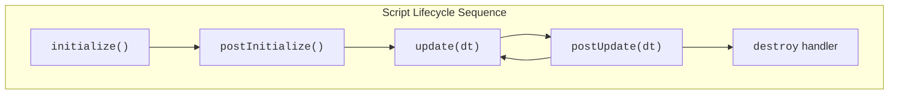

import Tabs from '@theme/Tabs';
import TabItem from '@theme/TabItem';

PlayCanvasのEntityにアタッチするすべてのスクリプトインスタンスは、明確に定義されたライフサイクルを経ます。このライフサイクルを理解することは、コードがいつ実行され、アプリケーションの他の部分とどのように相互作用するかを決定するため、非常に重要です。PlayCanvasは、スクリプト内で定義できるライフサイクルメソッドと呼ばれる特定の関数を提供します。エンジンは適切なタイミングでこれらのメソッドを自動的に呼び出します。

それは、役者の舞台での段階のようなものです：舞台裏での準備（`initialize`）、舞台での演技（`update`）、そして最後のカーテンコール（`destroy`イベント）。



:::note[実行順序]

EntityがScript Componentを介して複数のスクリプトをアタッチしている場合、それらのスクリプトのライフサイクルメソッド（`initialize`、`postInitialize`、`update`、`postUpdate`）は、その特定のEntityのコンポーネントのスクリプトリストに表示される順序で呼び出されることに注意することが重要です。この順序は、フレーム間で一貫して適用されます。

:::

## ライフサイクルメソッド {#lifecycle-methods}

各主要なライフサイクルメソッドを詳しく見ていきましょう。

### `initialize()`

**いつ呼び出されるか：**

* スクリプトインスタンスごとに一度。
* スクリプトインスタンスが作成され、そのEntityが有効になった後。
* すべてのScript Attributesがパースされ、初期値（デフォルトまたはEditorで設定された値）が割り当てられた後。
* 重要なことに、アプリケーションがロードされ、エンティティ階層が構築された後、最初の`update`ループまたはフレームがレンダリングされる前に呼び出されます。
* アプリケーションの開始時にEntityまたはスクリプトが無効になっている場合、`initialize`メソッドは、Entityとスクリプトの両方が初めて有効になったときに呼び出されます。

**目的：**

* これはスクリプトの主要なセットアップ、または「コンストラクタのような」フェーズです。
* 理想的な用途：
  * スクリプトの[ライフサイクルイベント](#lifecycle-events)を購読すること。
  * [DOMイベント](https://developer.mozilla.org/en-US/docs/Web/Events)ハンドラを登録すること。
  * スクリプトが内部的に管理する必要があるオブジェクトを作成すること。
  * シーン階層内の他のEntityへの参照をキャッシュすること。

:::warning[コンストラクタ vs initialize]

スタートアップロジックには`constructor`を使用せず、代わりに`initialize()`を使用してください。`constructor`の実行順序は保証されません。

:::

:::info[エンティティのクローン作成]

`entity.clone()`メソッドを使用してエンティティがクローンされる際、そのスクリプトの`initialize`メソッドは**即座には**呼び出されません。呼び出されるのは、クローンされたエンティティが後でシーン階層に追加されたとき（例：`this.app.root.addChild(clonedEntity)`を使用）、かつ、その時点でクローンされたエンティティとスクリプトインスタンスの両方が有効になっている場合に限られます。

:::

**例：**

<Tabs>
<TabItem value="esm" label="ESM">

```javascript
import { Script } from 'playcanvas';

export class MyScript extends Script {
    static scriptName = 'myScript';

    initialize() {
        // 一部のスクリプトライフサイクルイベントを購読します
        this.on('enable', () => {
            console.log('script enabled');
        });
        this.on('disable', () => {
            console.log('script disabled');
        });
        this.once('destroy', () => {
            console.log('script destroyed');
        });
    }
}
```

</TabItem>
<TabItem value="classic" label="Classic">

```javascript
var MyScript = pc.createScript('myScript');

MyScript.prototype.initialize = function() {
    // 一部のスクリプトライフサイクルイベントを購読します
    this.on('enable', () => {
        console.log('script enabled');
    });
    this.on('disable', () => {
        console.log('script disabled');
    });
    this.once('destroy', () => {
        console.log('script destroyed');
    });
};
```

</TabItem>
</Tabs>

### `postInitialize()`

**呼び出されるタイミング:**

* スクリプトインスタンスごとに一度。
* シーン内の有効なすべてのEntityのすべてのスクリプトインスタンスの`initialize()`メソッドが完了した後に呼び出されます。

**目的:**

* 他のスクリプトやEntityがすでに独自の`initialize()`フェーズを完了していることに依存するセットアップロジックに役立ちます。
* あるスクリプトが別のスクリプトのプロパティを、その別のスクリプトがそれらを設定する前にアクセスしようとする競合状態を回避するのに役立ちます。

**例:**

<Tabs>
<TabItem value="esm" label="ESM">

```javascript
import { Script } from 'playcanvas';

export class MyScript extends Script {
    static scriptName = 'myScript';

    initialize() {
        // シーン階層内の別のエンティティへの参照を取得します
        this.otherEntity = this.app.root.findByName('OtherEntity');

        // OtherEntityのinitializeメソッドが実行されると、
        // 'material'というプロパティが割り当てられると仮定します。この時点では、
        // OtherEntityのinitializeメソッドが実行されたことを確認できません...
    }

    postInitialize() {
        // しかし、ここに来るまでには実行されていることを確認できます...
        const material = this.otherEntity.material;
    }
}
```

</TabItem>
<TabItem value="classic" label="Classic">

```javascript
var MyScript = pc.createScript('myScript');

MyScript.prototype.initialize = function() {
    // シーン階層内の別のエンティティへの参照を取得します
    this.otherEntity = this.app.root.findByName('OtherEntity');

    // OtherEntityのinitializeメソッドが実行されると、
    // 'material'というプロパティが割り当てられると仮定します。この時点では、
    // OtherEntityのinitializeメソッドが実行されたことを確認できません...
};

MyScript.prototype.postInitialize = function() {
    // しかし、ここに来るまでには実行されていることを確認できます...
    const material = this.otherEntity.material;
};
```

</TabItem>
</Tabs>

### `update(dt)`

**呼び出されるタイミング:**

* スクリプトインスタンス、そのEntity、およびEntityの祖先がすべて有効になっている場合、毎フレーム。

**パラメータ:**

* dt (デルタタイム): 前のフレームから経過した時間を秒単位で表す数値です。これはフレームレートに依存しないロジックにとって重要です。

**目的:**

* これはスクリプトの実行時の動作の中核です。
* 用途:
  * 継続的な入力の処理。
  * 移動やアニメーションのための位置、回転、スケールの更新。
  * ゲームの状態の確認（例: 衝突、勝敗状態）。
  * 時間の経過とともに繰り返し実行する必要があるあらゆるロジック。

:::important

`update`は非常に頻繁に実行されるため、可能な限り効率的に保ってください。重い計算や割り当ては、他の場所（例: initialize）で実行できる場合は、ここで避けるようにしてください。

:::

**例:**

<Tabs>
<TabItem value="esm" label="ESM">

```javascript
import { Script } from 'playcanvas';

export class Rotator extends Script {
    static scriptName = 'rotator';

    update(dt) {
        // エンティティをワールドのY軸を中心に毎秒10度回転させます
        this.entity.rotate(0, 10 * dt, 0);
    }
}
```

</TabItem>
<TabItem value="classic" label="Classic">

```javascript
var Rotator = pc.createScript('rotator');

Rotator.prototype.update = function(dt) {
    // エンティティをワールドのY軸を中心に毎秒10度回転させます
    this.entity.rotate(0, 10 * dt, 0);
};
```

</TabItem>
</Tabs>

### `postUpdate(dt)`

**呼び出されるタイミング:**

* スクリプトインスタンスとそのEntityが有効になっている場合、毎フレーム。
* 現在のフレームにおけるすべてのスクリプトインスタンスの`update()`メソッドが完了した後に呼び出されます。

**パラメータ:**

* dt (デルタタイム): `update()`と同じです。

**目的:**

* すべての主要な更新が行われた後に実行する必要があるロジックに役立ちます。
* 一般的な使用例：プレイヤーを追跡するカメラスクリプト。プレイヤーの更新によってプレイヤーが移動し、カメラの`postUpdate`がカメラの位置を調整して、プレイヤーの新しい位置にスムーズに追従します。

**例:**

<Tabs>
<TabItem value="esm" label="ESM">

```javascript
import { Script } from 'playcanvas';

export class TrackingCamera extends Script {
    static scriptName = 'trackingCamera';

    initialize() {
        this.player = this.app.root.findByName('Player');
    }

    postUpdate(dt) {
        // ここまでにプレイヤーの位置が更新されていることがわかります...
        const playerPos = this.player.getPosition();
        this.entity.lookAt(playerPos);
    }
}
```

</TabItem>
<TabItem value="classic" label="Classic">

```javascript
var TrackingCamera = pc.createScript('trackingCamera');

TrackingCamera.prototype.initialize = function() {
    this.player = this.app.root.findByName('Player');
};

TrackingCamera.prototype.postUpdate = function(dt) {
    // ここまでにプレイヤーの位置が更新されていることがわかります...
    const playerPos = this.player.getPosition();
    this.entity.lookAt(playerPos);
};
```

</TabItem>
</Tabs>

## ライフサイクルイベント {#lifecycle-events}

主要なライフサイクルメソッド（`initialize`、`postInitialize`、`update`、`postUpdate`）以外にも、スクリプトインスタンスはライフサイクルの重要な瞬間に特定のイベントを発行します。これらのイベントを購読することで、状態が変化したときにカスタムロジックを実行できます。これは、リソースの管理、動作の切り替え、最終的なクリーンアップの実行に特に役立ちます。

主な3つのライフサイクルイベントは、`enable`、`disable`、および`destroy`です。

### `enable` イベント {#enable-event}

**いつ発生するか：**

* スクリプトインスタンスが有効になったとき。これはいくつかの方法で発生する可能性があります：
  * スクリプトコンポーネントとそのEntityの両方が有効な状態で開始する場合、スクリプトが最初に初期化されたとき。
  * `this.enabled`がプログラムで`false`から`true`に設定されたとき。
  * スクリプトの親Entity（または祖先のEntity）が有効になり、スクリプト自体がすでに有効としてマークされていたとき。

**目的：**

* スクリプトが非アクティブ状態からアクティブ状態になったときにアクションを実行するため。
* 以下に最適です：
  * 一時停止されていた動作を再度有効にする（例：アニメーションの再開、disable時に削除されたイベントリスナーの再登録）。
  * アクティブなステータスを反映するように視覚的な状態を更新する。

**購読方法：**

```javascript
// 通常、initialize() 内で...
this.on('enable', () => {
    console.log('script enabled'); // スクリプトが有効化されました
});
```

:::tip

スクリプトが有効な状態で開始する場合、`enable`イベントは初期化フェーズ中に発生します。スクリプトが有効な状態で開始する場合でも、`onEnable`からの特定のセットアップが実行されることを保証する必要がある場合は、購読後に`initialize`内で`if (this.enabled)`チェックで保護しながらハンドラーを直接呼び出すことができます。

:::

### `disable` イベント {#disable-event}

**いつ発生するか：**

* スクリプトインスタンスが無効になったとき。これは次の場合に発生する可能性があります：
  * `this.enabled`がプログラムで`true`から`false`に設定されたとき。
  * スクリプトの親Entity（または祖先のEntity）が無効になったとき。
  * `destroy`イベントが発生する前（スクリプトは破棄される前に暗黙的に無効化されるため）。

**目的：**

* スクリプトが非アクティブ状態になったときにアクションを実行するため。
* 以下に最適です：
  * 動作を一時停止する（例：アニメーションの停止、アクティブなときにのみ関連するイベントリスナーの登録解除）。
  * 有効なときにのみ必要な一時的なリソースを解放する。
  * 非アクティブなステータスを反映するように視覚的な状態を更新する。

**購読方法：**

```javascript
// 通常、initialize() 内で...
this.on('disable', () => {
    console.log('script disabled'); // スクリプトが無効化されました
});
```

### `state` イベント {#state-event}

**いつ発生するか：**

* スクリプトインスタンスの実効実行状態が有効から無効へ、または無効から有効へ変化したとき。これは次の場合に発生する可能性があります：

* スクリプトインスタンスの`this.enabled`プロパティがプログラムによって変更された場合。
  * 親のスクリプトコンポーネントの`enabled`状態が変更された場合。
  * スクリプトの親エンティティ（または祖先エンティティ）の`enabled`状態が変更された場合。

**目的:**

* スクリプトのアクティブ状態のあらゆる変更に反応するための単一のコールバックを提供します。
* スクリプトが有効になったばかりか無効になったばかりかに関わらず、多くの場合、新しい状態自体に基づいてアクションを実行する必要がある場合に役立ちます。
* 必要なアクションが両方の場合で類似しているが、結果の状態に依存する場合、[`enable`](#enable-event) と [`disable`](#disable-event) を個別に処理するよりもロジックを簡素化できることがあります。

**パラメーター:**

* enabled (boolean): スクリプトインスタンスの新しい状態（有効になったばかりの場合は`true`、無効になったばかりの場合は`false`）。

**購読方法:**

```javascript
// 通常、initialize() の内部で...
this.on('state', (enabled) => {
    console.log(`script ${enabled ? 'enabled' : 'disabled'}`);
});
```

### `destroy` イベント {#destroy-event}

**発火条件:**

* スクリプトインスタンスが破棄されようとしている時。これは以下の状況で発生します:
  * その親エンティティが破棄された場合。
  * このスクリプトインスタンスを含むスクリプトコンポーネントがエンティティから削除された場合。
  * スクリプトインスタンス自体が明示的に破棄された場合（例: `this.destroy()`、ただし直接呼び出すことは稀です）。

**目的:**

* これはスクリプトの最終クリーンアップフェーズです。メモリリークを防ぎ、スクリプトの機能をクリーンにシャットダウンするために不可欠です。
* 以下に不可欠です:
  * スクリプトがサブスクライブしたすべてのイベントから登録解除する（例: `this.app.off(...)`、`someEntity.off(...)`、自身のイベントの場合は`this.off(...)`）。
  * スクリプトが作成した、または参照を保持している外部リソースやDOM要素を解放する。
  * ガーベージコレクターを助けるために、他のオブジェクトへの参照をNULLにする。

**購読方法:**

```javascript
// 通常、initialize() の内部で...
this.once('destroy', () => {
    console.log('script destroyed');
});
```

:::tip[on vs once]

`destroy`ハンドラーは一度だけ実行される必要があるため、`this.once('destroy', ...)`を使用するのが一般的です。

:::

:::important[イベントハンドラーの登録解除]

スクリプトが`on`または`once`を使用してイベントハンドラーを登録している場合、`destroy`ハンドラーでそれらのハンドラーに`off`を使用することを忘れないでください。そうしないと、ガーベージコレクターがスクリプトによって使用されているメモリを解放できない可能性があります。

:::
