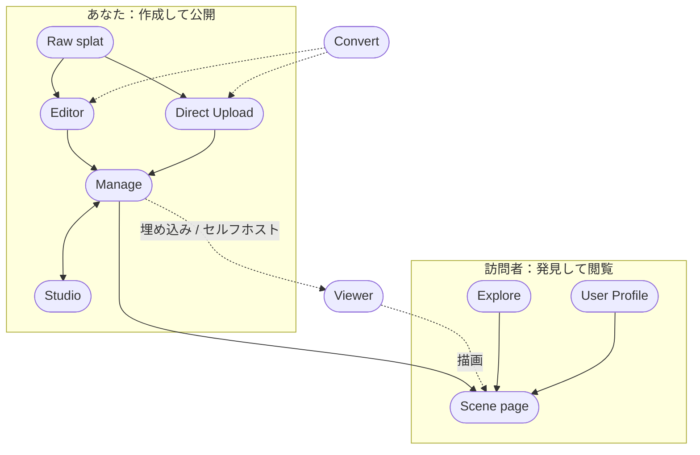

[SuperSplat](https://superspl.at)はPlayCanvasの3Dガウシアンスプラット向け編集・公開プラットフォームです。生のスプラットキャプチャを、クリーンアップから、カメラ、アニメーション、注釈、ポストエフェクト、コリジョンを備えた洗練された共有可能なシーンへと仕上げ、最新のブラウザで誰でも視聴できる状態にします。

このプラットフォームは複数のコンポーネントで構成されています。クリエイターとして使うもの、訪問者が作品を視聴するために使うもの、そして汎用のユーティリティがあります。

:::tip Editorを省略することもできます

すでにクリーンなスプラットファイルをお持ちの場合、Editorを使う必要はありません。[superspl.atのホームページ](https://superspl.at)（または[Manageページ](manage)）にあるオレンジ色の**Upload Splat**ボタンを押すと、プラットフォームに直接公開できます。

:::

## プラットフォーム

| サーフェス | 概要 | 場所 |
|---------|------------|----------------|
| **[Editor](editor/)** | スプラットをクリーンアップ、クロップ、色調整、アニメーション化するブラウザベースのエディタ。superspl.atに公開できます。 | [superspl.at/editor](https://superspl.at/editor) |
| **[Direct Upload](upload)** | Editorを開かずに、すでにクリーンなスプラットファイルを公開します。 | [superspl.at](https://superspl.at)のオレンジ色の**Upload Splat**ボタン |
| **[Manage](manage)** | あなたのスプラットライブラリ：タイトルや説明の編集、公開範囲の変更、ダウンロード可否とライセンスの選択、削除、Studioで開く操作ができます。 | [superspl.at/manage](https://superspl.at/manage) |
| **[Studio](studio/)** | 公開後の視聴体験をキュレーションします：カメラ、アニメーション、注釈、ポストエフェクト、スカイボックス、コリジョン。YouTube Studio風のシーンごとのURLを持ちます。 | `superspl.at/scene/<hash>/studio` |
| **[Scene page](scene-page)** | 公開済みスプラットの公開ページ：埋め込みビューア、シェア、埋め込み、ダウンロード、コメント、いいね、おすすめスプラット。 | `superspl.at/scene/<hash>` |
| **[Explore](explore)** | ソート、期間、特集フィルタと検索を備えた公開ギャラリー。superspl.atのホームページです。 | [superspl.at](https://superspl.at) |
| **[User Profile](user-profile)** | ユーザーの公開ページ：アバター、自己紹介、ソーシャルリンク、公開済みスプラット。 | `superspl.at/user?id=<username>` |
| **[Viewer](viewer/)** | シーンページとEditorのHTMLエクスポートを動かしているオープンソースのウェブビューア。自分のページに埋め込むか、セルフホストできます。 | npm `@playcanvas/supersplat-viewer`、[GitHub](https://github.com/playcanvas/supersplat-viewer) |
| **[Convert](convert)** | [splat-transform](/user-manual/splat-transform/) CLIのウェブフロントエンド：ブラウザ上で形式変換、トランスフォーム、フィルタを実行します。 | [superspl.at/convert](https://superspl.at/convert) |

舞台裏では、公開されたすべてのスプラットはSOG形式に圧縮され、大きなスプラット（100万ガウシアンを超えるもの）は、どのデバイスでも高速に読み込めるよう自動的にLODストリーミングされます — [ストリーミングとパフォーマンス](streaming)を参照してください。

## オープンソース vs ホスト型

SuperSplatはオープンな基盤の上に、ホスト型プラットフォームを重ねた構成になっています。

| コンポーネント | ソース | ライセンス |
|-----------|--------|---------|
| Editor | [playcanvas/supersplat](https://github.com/playcanvas/supersplat) | MIT |
| Viewer | [playcanvas/supersplat-viewer](https://github.com/playcanvas/supersplat-viewer) | MIT |
| splat-transform（Convertの実装基盤） | [playcanvas/splat-transform](https://github.com/playcanvas/splat-transform) | MIT |
| Studio、Manage、Explore、Scene page、Convert UI、publish/scene API | PlayCanvasがsuperspl.atでホスト | プロプライエタリ |

EditorのHTMLエクスポートやViewerのnpmパッケージを使って、公開済みスプラットを自前のインフラだけでホストすることも可能です。詳細は[ビューアのセルフホスティング](viewer/self-hosting)を参照してください。

## アカウント

superspl.atへの**スプラットの公開**、スプラットへの**コメント**、スプラットへの**いいね**には、無料のPlayCanvasアカウントが必要です。[Explore](explore)ページの閲覧と公開[シーンページ](scene-page)の視聴は匿名で可能です。アカウント作成は[アカウント作成](/user-manual/account-management/user-accounts/account-creation)を参照してください。

## 次のステップ

典型的な初回ワークフローは次のとおりです：

1. [Editorを開いて](editor/)PLYを読み込みます。すでにクリーンなファイルをお持ちの場合はステップ2に進みます。
2. （Editorから）[公開](editor/publishing)するか、直接[アップロード](upload)します。スプラットは[Manageページ](manage)に表示されます。
3. [Studioで開いて](studio/)、カメラ、アニメーション、注釈、ポストエフェクト、スカイボックス、コリジョンを追加します。
4. [シーンページ](scene-page)のURLを共有するか、[Viewerを埋め込んで](viewer/embedding)自分のサイトに統合します。
