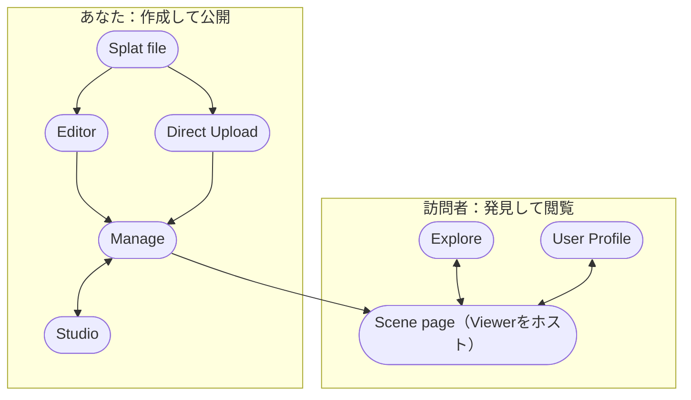

import Link from '@docusaurus/Link';

[SuperSplat](https://superspl.at)は、生の3Dガウシアンスプラットのキャプチャを、洗練された共有可能な3Dシーンに仕上げるためのプラットフォームです。ブラウザでクリーンアップし、ワンクリックで公開し、誰でもどんなデバイスからでも探索できるようにします。

    <iframe src="https://superspl.at/s?id=3ae6a716" title="ミツバチ — superspl.atで公開・キュレーションされたガウシアンスプラット" allow="fullscreen; xr-spatial-tracking" allowFullScreen loading="lazy"></iframe>

ドラッグで回転、スクロールでズーム、番号付きのホットスポットをクリックしてみてください。この[danylyon](https://superspl.at/user/danylyon)によるミツバチは、[Editor](editor/)でクリーンアップし、[superspl.at](https://superspl.at)に公開し、[Studio](studio/)で注釈を付けたものです。このページでは、あなた自身のキャプチャで同じことを行う方法を案内します。

## 60秒でわかるSuperSplat

    <iframe src="https://www.youtube.com/embed/7B0KdoJCUK8" title="SuperSplat：3Dガウシアンスプラットの編集、公開、共有" allow="accelerometer; clipboard-write; encrypted-media; gyroscope; picture-in-picture; web-share" allowFullScreen loading="lazy"></iframe>

閲覧、視聴、クリーンアップ、公開、キュレーション、変換、共有。プラットフォーム全体を1分以内で紹介します。

## どこから始めますか？

  

    <Link className="card path-card" to="/user-manual/supersplat/getting-started/">
      
<h3>🧹 スプラットファイルを持っている</h3>

      

ブラウザベースのEditorでフローターを取り除き、シーンをクロップして公開しましょう。クイックスタートに沿って進めれば、約10分で共有可能なシーンページが完成します。

      
はじめに →

    </Link>
  

  

    <Link className="card path-card" to="/user-manual/supersplat/studio/">
      
<h3>🎬 スプラットを公開済み</h3>

      

Studioで仕上げましょう。最初のカメラを決め、注釈付きのホットスポットを追加し、ブルームやカラーグレーディングを調整し、スカイボックスを設定し、コリジョンでシーンを歩けるようにできます。

      
Studio →

    </Link>
  

  

    <Link className="card path-card" to="/user-manual/supersplat/viewer/">
      
<h3>🧩 自分のサイトやアプリでスプラットを使いたい</h3>

      

オープンソースのViewerをiframeで埋め込む、単一HTMLファイルのビューアをエクスポートしてセルフホストする、あるいはAPIを使って自分のパイプラインから公開することができます。

      
Viewer、埋め込み、API →

    </Link>
  

  

    <Link className="card path-card" to="/user-manual/gaussian-splatting/creating/">
      
<h3>📷 まだスプラットを持っていない</h3>

      

スプラットがどのようにキャプチャ・トレーニングされるかを学び、ワンタップのスマートフォンアプリからデスクトップのトレーナーまで、自分に合ったツールを選びましょう。最初のPLYができたら、ここに戻ってきてください。

      
スプラットの作成 →

    </Link>
  

:::tip すでにクリーンなスプラットをお持ちですか？

Editorを省略できます。[superspl.atのホームページ](https://superspl.at)にあるオレンジ色の**Upload Splat**ボタンを押すか、[Direct Upload](upload)を使って、完成済みのファイルを[Manageページ](manage)に直接公開できます。

:::

## 10分で最初のスプラットを公開する

1. **読み込む。** [superspl.at/editor](https://superspl.at/editor)を開き、スプラットファイルをドロップします。対応形式は[インポートとエクスポート](editor/import-export)を参照してください。
2. **クリーンアップする。** ブラシ、スフィア、ボックスの各選択ツールで浮遊するフローターを選択し、<kbd>Delete</kbd>を押します。[選択とクリーンアップ](editor/editing-splats)を参照してください。
3. **公開する。** **File → Publish**を選びます。スプラットは[Manageページ](manage)に追加され、専用の[シーンページ](scene-page)が作られます。[公開](editor/publishing)を参照してください。
4. **キュレーションする。** [Studio](studio/)で開き、カメラを決め、注釈を追加し、ポストエフェクトを有効にします。
5. **共有する。** シーンのリンクをコピーする、埋め込みスニペットを取得する、または**Public**に設定して[Explore](explore)に表示させます。

[はじめに](getting-started)ガイドでは、各ステップをスクリーンショット付きで解説しています。

## 各コンポーネントの関係

SuperSplatのコンポーネントには、クリエイターとして使うもの、訪問者が作品を視聴するために使うもの、そして汎用のユーティリティがあります。

```mermaid
flowchart TB
    subgraph you [あなた：作成して公開]
        direction LR
        raw([Splat file]) --> editor([Editor])
        raw --> upload([Direct Upload])
        editor --> manage([Manage])
        upload --> manage
        manage <--> studio([Studio])
    end

    manage --> scene(["Scene page（Viewerをホスト）"])

    subgraph visitors [訪問者：発見して閲覧]
        direction LR
        explore([Explore]) <--> scene
        profile([User Profile]) <--> scene
    end
```

| サーフェス | 概要 | 場所 |
|---------|------------|----------------|
| **[Editor](editor/)** | スプラットをクリーンアップ、クロップ、色調整、アニメーション化するブラウザベースのエディタ。superspl.atに公開できます。 | [superspl.at/editor](https://superspl.at/editor) |
| **[Direct Upload](upload)** | Editorを開かずに、すでにクリーンなスプラットファイルを公開します。 | [superspl.at](https://superspl.at)のオレンジ色の**Upload Splat**ボタン |
| **[Manage](manage)** | あなたのスプラットライブラリ：タイトルや説明の編集、公開範囲の変更、ダウンロード可否とライセンスの選択、削除、Studioで開く操作ができます。 | [superspl.at/manage](https://superspl.at/manage) |
| **[Studio](studio/)** | 公開後の視聴体験をキュレーションします：カメラ、注釈、ポストエフェクト、スカイボックス、コリジョン。 | `superspl.at/scene/<hash>/studio` |
| **[Scene page](scene-page)** | 公開済みスプラットの公開ページ：埋め込みビューア、シェア、埋め込み、ダウンロード、コメント、いいね、おすすめスプラット。 | `superspl.at/scene/<hash>` |
| **[Explore](explore)** | ソート、期間、特集フィルタと検索を備えた公開ギャラリー。superspl.atのホームページです。 | [superspl.at](https://superspl.at) |
| **[User Profile](user-profile)** | クリエイターの公開ページ：アバター、自己紹介、ソーシャルリンク、公開済みスプラット。 | `superspl.at/user/<username>` |
| **[Viewer](viewer/)** | シーンページとEditorのHTMLエクスポートを動かしているオープンソースのウェブビューア。自分のページに埋め込むか、セルフホストできます。 | npm `@playcanvas/supersplat-viewer`、[GitHub](https://github.com/playcanvas/supersplat-viewer) |
| **[Convert](convert)** | [splat-transform](/user-manual/splat-transform/) CLIのウェブフロントエンド：ブラウザ上で形式変換、トランスフォーム、フィルタを実行します。 | [superspl.at/convert](https://superspl.at/convert) |
| **[APIと統合](api-integrations)** | キャプチャツール、トレーニングパイプライン、カスタムアプリケーションからシーンを公開・確認します。 | [APIリファレンス](/user-manual/api/supersplat/) |

## 知っておきたいこと

- **すべてブラウザで動きます。** Editorはスプラットをローカルで読み込み、あなたが公開を選ぶまで何もアップロードされません。WebGPUに対応したブラウザ（最新のChromeまたはEdge、Safari 26以降、WebGPUを有効にしたFirefox）が必要です。
- **閲覧は匿名でできます。** 公開、いいね、コメントには無料のPlayCanvasアカウントが必要です。[アカウント作成](/user-manual/account-management/user-accounts/account-creation)を参照してください。
- **中核はオープンソースです。** [Editor](https://github.com/playcanvas/supersplat)、[Viewer](https://github.com/playcanvas/supersplat-viewer)、そしてConvertを支える[splat-transform](https://github.com/playcanvas/splat-transform)はMITライセンスです。Studio、Manage、Explore、シーンページ、公開APIはPlayCanvasがsuperspl.atでホストしています。
- **公開時に自動で最適化されます。** 公開されたすべてのスプラットはSOG形式に圧縮され、100万ガウシアンを超えるスプラットはプログレッシブにストリーミングされるため、どのデバイスでも高速に読み込めます。[ストリーミングとパフォーマンス](streaming)を参照してください。
- **セルフホストもできます。** Editorから単一HTMLファイルのビューアをエクスポートするか、Viewerのnpmパッケージを使います。[ビューアのセルフホスティング](viewer/self-hosting)を参照してください。

## 最新情報を追う

- [PlayCanvasブログのSuperSplat関連記事](https://blog.playcanvas.com/tags/supersplat/)
- [Discord](https://discord.gg/RSaMRzg) — 質問や作品の共有に
- [GitHub](https://github.com/playcanvas/supersplat) — Issueやコントリビューションに
