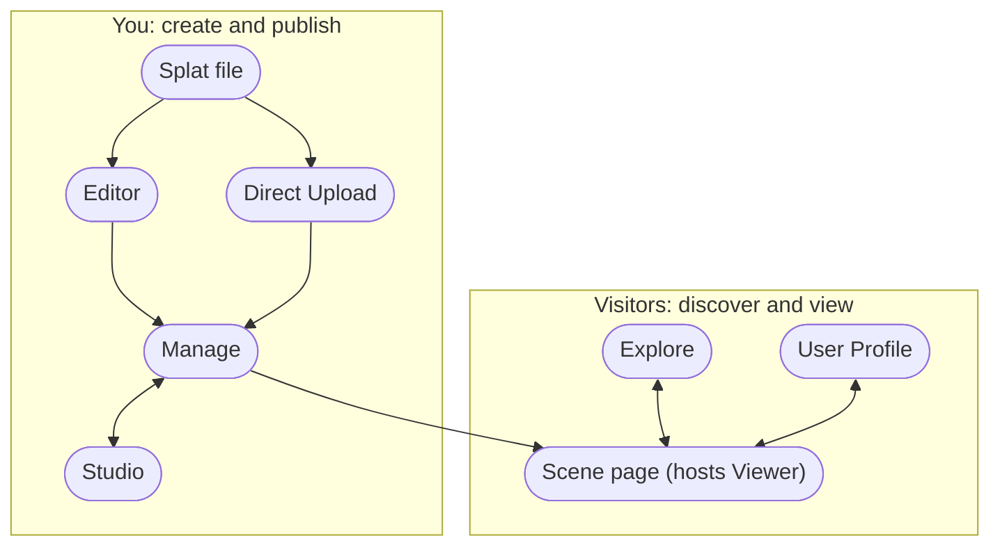

# SuperSplat

[SuperSplat](https://superspl.at) turns a raw 3D Gaussian Splat capture into a polished, shareable 3D scene. Clean it up in your browser, publish it with one click, and let anyone explore it on any device.

[Interactive demo: Honeybee — a Gaussian splat published and curated on superspl.at](https://superspl.at/s?id=3ae6a716)

Drag to orbit, scroll to zoom, and click the numbered hotspots. This honeybee by [danylyon](https://superspl.at/user/danylyon) was cleaned in the [Editor](https://developer.playcanvas.com/user-manual/supersplat/editor.md), published to [superspl.at](https://superspl.at), and annotated in [Studio](https://developer.playcanvas.com/user-manual/supersplat/studio.md). Everything on this page is about doing the same with your own captures.

## SuperSplat in 60 seconds

[Video: SuperSplat: Edit, Publish and Share 3D Gaussian Splats](https://www.youtube.com/embed/7B0KdoJCUK8)

Browse, view, clean up, publish, curate, convert, and share: the whole platform in under a minute.

## Where do you want to start?

[🧹 I have a splat file](https://developer.playcanvas.com/user-manual/supersplat/getting-started.md): Clean up floaters, crop the scene, and publish it from the browser-based Editor. Follow the quick start and you'll have a shareable scene page in about ten minutes. Getting Started →
[🎬 I've published a splat](https://developer.playcanvas.com/user-manual/supersplat/studio.md): Make it shine in Studio: frame the opening camera, add annotated hotspots, dial in bloom and color grading, set a skybox, or make the scene walkable with collision. Studio →
[🧩 I want splats on my own site or app](https://developer.playcanvas.com/user-manual/supersplat/viewer.md): Embed the open-source Viewer with an iframe, export a single-file HTML viewer to host yourself, or publish from your own pipeline with the API. Viewer, embedding and API →
[📷 I don't have a splat yet](https://developer.playcanvas.com/user-manual/gaussian-splatting/creating.md): Learn how a splat is captured and trained, and pick a tool that fits you, from one-tap phone apps to desktop trainers. Then come back here with your first PLY. Creating Splats →

:::tip Already have a clean splat?

You can skip the Editor. Hit the orange **Upload Splat** button on the [superspl.at home page](https://superspl.at) or use [Direct Upload](https://developer.playcanvas.com/user-manual/supersplat/upload.md) to publish a ready-made file straight to your [Manage page](https://developer.playcanvas.com/user-manual/supersplat/manage.md).

:::

## Your first splat in 10 minutes

1. **Load.** Open [superspl.at/editor](https://superspl.at/editor) and drop in your splat file. See [Import and Export](https://developer.playcanvas.com/user-manual/supersplat/editor/import-export.md) for the supported formats.
2. **Clean.** Select stray floaters with the brush, sphere, or box selection tools and press <kbd>Delete</kbd>. See [Selection and Cleanup](https://developer.playcanvas.com/user-manual/supersplat/editor/editing-splats.md).
3. **Publish.** Choose **File → Publish**. Your splat lands on your [Manage page](https://developer.playcanvas.com/user-manual/supersplat/manage.md) with its own [scene page](https://developer.playcanvas.com/user-manual/supersplat/scene-page.md). See [Publishing](https://developer.playcanvas.com/user-manual/supersplat/editor/publishing.md).
4. **Curate.** Open it in [Studio](https://developer.playcanvas.com/user-manual/supersplat/studio.md) to frame the camera, add annotations, and switch on post effects.
5. **Share.** Copy the scene link, grab the embed snippet, or set it to **Public** so it appears in [Explore](https://developer.playcanvas.com/user-manual/supersplat/explore.md).

The [Getting Started](https://developer.playcanvas.com/user-manual/supersplat/getting-started.md) guide walks through each step with screenshots.

## How the pieces fit together

Some parts of SuperSplat you use as a creator, some your visitors use to view what you've made, and some are general-purpose utilities.

| Surface | What it is | Where it lives |
|---------|------------|----------------|
| **[Editor](https://developer.playcanvas.com/user-manual/supersplat/editor.md)** | Browser-based editor for cleaning, cropping, color-adjusting, and animating splats. Publishes to superspl.at. | [superspl.at/editor](https://superspl.at/editor) |
| **[Direct Upload](https://developer.playcanvas.com/user-manual/supersplat/upload.md)** | Publish an already-clean splat file without opening the Editor. | The orange **Upload Splat** button on [superspl.at](https://superspl.at) |
| **[Manage](https://developer.playcanvas.com/user-manual/supersplat/manage.md)** | Your splat library: edit title and description, change visibility, choose downloadable + license, delete, open in Studio. | [superspl.at/manage](https://superspl.at/manage) |
| **[Studio](https://developer.playcanvas.com/user-manual/supersplat/studio.md)** | Curate the published viewing experience: cameras, annotations, post effects, skybox, collision. | `superspl.at/scene/<hash>/studio` |
| **[Scene page](https://developer.playcanvas.com/user-manual/supersplat/scene-page.md)** | Public page for a published splat: embedded viewer, share, embed, download, comments, likes, suggested splats. | `superspl.at/scene/<hash>` |
| **[Explore](https://developer.playcanvas.com/user-manual/supersplat/explore.md)** | Public gallery with sort, time, feature filters, and search. The superspl.at home page. | [superspl.at](https://superspl.at) |
| **[User Profile](https://developer.playcanvas.com/user-manual/supersplat/user-profile.md)** | A creator's public page: avatar, bio, social links, their published splats. | `superspl.at/user/<username>` |
| **[Viewer](https://developer.playcanvas.com/user-manual/supersplat/viewer.md)** | The open-source web viewer that powers scene pages and Editor HTML exports. Embed it in your own page or self-host it. | npm `@playcanvas/supersplat-viewer`, [GitHub](https://github.com/playcanvas/supersplat-viewer) |
| **[Convert](https://developer.playcanvas.com/user-manual/supersplat/convert.md)** | Web frontend to the [splat-transform](https://developer.playcanvas.com/user-manual/splat-transform.md) CLI: convert formats, transform, and filter in the browser. | [superspl.at/convert](https://superspl.at/convert) |
| **[API & Integrations](https://developer.playcanvas.com/user-manual/supersplat/api-integrations.md)** | Publish and inspect scenes from capture tools, training pipelines, and custom applications. | [API reference](https://developer.playcanvas.com/user-manual/api/supersplat/) |

## Good to know

- **Everything runs in your browser.** The Editor loads splats locally and nothing is uploaded until you choose to publish. It needs a WebGPU-capable browser: current Chrome or Edge, Safari 26 or later, or Firefox with WebGPU enabled.
- **Browsing is anonymous.** A free PlayCanvas account is needed to publish, like, or comment. See [Account Creation](https://developer.playcanvas.com/user-manual/account-management/user-accounts/account-creation.md).
- **Open source at the core.** The [Editor](https://github.com/playcanvas/supersplat), the [Viewer](https://github.com/playcanvas/supersplat-viewer), and [splat-transform](https://github.com/playcanvas/splat-transform) (which powers Convert) are MIT-licensed. Studio, Manage, Explore, scene pages, and the publish API are hosted by PlayCanvas on superspl.at.
- **Publishing optimizes for you.** Every published splat is compressed to SOG, and splats over one million Gaussians are streamed progressively so they load fast on any device. See [Streaming & Performance](https://developer.playcanvas.com/user-manual/supersplat/streaming.md).
- **You can host it yourself.** Export a single-file HTML viewer from the Editor or use the Viewer npm package. See [Self-Hosting the Viewer](https://developer.playcanvas.com/user-manual/supersplat/viewer/self-hosting.md).

## Stay in the loop

- [SuperSplat news on the PlayCanvas blog](https://blog.playcanvas.com/tags/supersplat/)
- [Discord](https://discord.gg/RSaMRzg) for questions and sharing your splats
- [GitHub](https://github.com/playcanvas/supersplat) for issues and contributions
